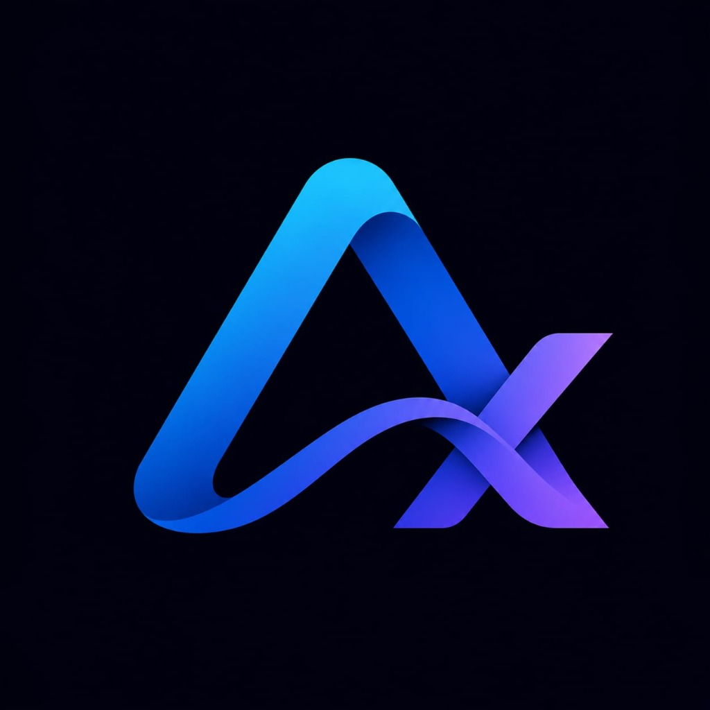

<div align="center">



# AnalyzaX
### The Autonomous AI Data Analytics & Engineering Platform

**Deterministic Data Intelligence • Zero Numerical Hallucinations • Enterprise-Grade Analytical Engines**

[](https://fastapi.tiangolo.com)
[](https://duckdb.org)
[](https://pola.rs)
[](https://nextjs.org)
[](https://tanstack.com)
[](https://echarts.apache.org)
[](https://scikit-learn.org)
[](https://python.org)
[](LICENSE)

<p align="center">
  <a href="#key-features">Key Features</a> •
  <a href="#why-analyzax">Why AnalyzaX?</a> •
  <a href="#architecture">Architecture</a> •
  <a href="#dual-frontend-experience">Dual Frontend</a> •
  <a href="#quickstart">Quickstart</a> •
  <a href="#the-analyzax-constitution">Engineering Constitution</a> •
  <a href="#api-reference">API Reference</a> •
  <a href="#roadmap">Roadmap</a>
</p>

---

</div>

## 🌟 Overview

**AnalyzaX** is a next-generation autonomous data analytics platform engineered to bridge the gap between raw, messy enterprise datasets and production-ready decision intelligence.

Unlike naive LLM wrappers that paste raw data into chat prompts and hallucinate calculations, AnalyzaX operates on a fundamental principle:

> **"Deterministic software calculates numbers. Intelligent AI reasons over verified facts."**

AnalyzaX orchestrates **11 high-performance analytical engines** (powered by DuckDB, Polars, SciPy, statsmodels, and scikit-learn) with an **autonomous LLM Copilot** equipped with 16 analytical tools. The result is an end-to-end analytics workflow from ingestion and quality audit to SQL analytics, AutoML, forecasting, and interactive visualizations.

```text
Raw Dataset ➔ Ingestion & Parquet ➔ 6D Quality Audit ➔ Lineage Cleaning ➔ Vectorized SQL ➔ EDA & Stats ➔ AutoML ➔ Forecasting ➔ AI Analyst Copilot ➔ Executive Dashboards & Exports
```

---

## ⚡ Why AnalyzaX? The Paradigm Shift

Traditional analytics tools force teams to choose between manual BI dashboard fatigue, steep SQL learning curves, or risky generative AI tools that hallucinate statistics.

| Feature | Naive AI Analytics / Chatbots | Traditional BI Tools (Tableau, PowerBI) | **AnalyzaX Platform** |
| :--- | :--- | :--- | :--- |
| **Numerical Accuracy** | ❌ Hallucinates averages, correlations, sums | ✅ Deterministic (rigid calculations) | 🛡️ **100% Deterministic (DuckDB + Polars)** |
| **Data Privacy** | ❌ Sends entire datasets to external LLMs | 🔒 On-premise / cloud DB | 🔒 **Zero raw data sent to LLMs (Aggregated context only)** |
| **Transformation Lineage**| ❌ Ephemeral & untraceable | ⚠️ Complex ETL dependencies | 📜 **Immutable DAG Versioning & Cleaning Recipes** |
| **Interactive SQL** | ❌ Blind text generation | ⚠️ Manual syntax authoring | ⚡ **AST-Sandboxed DuckDB Vectorized Workbench** |
| **Machine Learning** | ❌ Non-existent | ❌ Requires data science team | 🧠 **Built-in AutoML (Auto-detection, Train/Test, ROC/AUC)** |
| **Forecasting** | ❌ Guesses future trends | ⚠️ Basic trendline extrapolations | 🔮 **Statistical ARIMA, ETS & Stationarity Tests** |
| **User Interface** | ❌ Chat text only | ⚠️ Heavy, dated enterprise UIs | 🎨 **Modern Dual Frontend (Next.js & TanStack/Lovable)** |

---

## 🏗️ Architecture

AnalyzaX strictly enforces a **4-tier layered architecture** separating presentation, routing, application orchestration, domain computation engines, and data storage.

```mermaid
flowchart TD
    subgraph Presentation["🎨 Presentation Layer (Dual Frontend)"]
        FE1["Next.js 14 Enterprise (App Router)"]
        FE2["Frontend_Lovable (TanStack Start & Router)"]
    end

    subgraph Transport["🚀 Transport & Routing (FastAPI)"]
        API["FastAPI REST & SSE Router (/api/v1)"]
        CORS["Security & CORS Middleware"]
    end

    subgraph Services["⚙️ Application Services"]
        SVC1["Dataset Service"]
        SVC2["SQL Query Service"]
        SVC3["Data Quality Service"]
        SVC4["AutoML & Forecasting Service"]
        SVC5["AI Analyst Copilot Service"]
    end

    subgraph Engines["🧩 11 Deterministic Analytical Engines"]
        E1["Ingestion Engine (MIME, Parquet)"]
        E2["Profiling Engine (Column Types, Stats)"]
        E3["Quality Engine (6D Audit, Anomaly)"]
        E4["Cleaning Engine (Diffs, Lineage DAG)"]
        E5["SQL Engine (DuckDB, AST Parser)"]
        E6["EDA Engine (Polars Distributions)"]
        E7["Statistics Engine (SciPy Tests)"]
        E8["ML Engine (scikit-learn AutoML)"]
        E9["Forecasting Engine (ARIMA, ETS)"]
        E10["Visualization Engine (Chart Advisor)"]
        E11["Export Engine (PDF, Excel, Parquet)"]
    end

    subgraph Data["💾 Storage & Execution Layer"]
        DuckDB[("DuckDB Vectorized In-Memory / File")]
        Polars["Polars High-Performance DataFrames"]
        Postgres[("PostgreSQL Metadata & DAG")]
        Filesystem["Immutable Parquet Filesystem Storage"]
    end

    Presentation --> API
    API --> CORS
    CORS --> Services
    Services --> Engines
    Engines --> Data
```



---

## 🚀 Key Features & Capabilities

### 1. 📥 Ingestion & Columnar Profiling
- Multi-format ingestion: CSV, Excel (`.xlsx`), JSON, Parquet, and TSV.
- Automatic schema inference, null detection, cardinality scoring, memory footprint estimation, and zero-copy conversion to versioned Parquet storage.

### 2. 🔍 6-Dimensional Data Quality Engine
Audits datasets across 6 foundational quality dimensions:
- **Completeness**: Missing values, null ratios, and column drop thresholds.
- **Uniqueness**: Primary key candidate detection and duplicate row tracking.
- **Validity**: Type conformance, regex compliance, and format detection.
- **Consistency**: Conflicting values across cross-dependent fields.
- **Timeliness**: Temporal freshness, interval gaps, and datetime validation.
- **Accuracy**: Z-Score, IQR, and Isolation Forest statistical outlier detection.

### 3. 🧹 Interactive Cleaning & Immutable Lineage
- **The Analytical Handshake**: *Detect ➔ Explain ➔ Suggest ➔ Approve ➔ Apply ➔ Log*.
- Step-by-step transformation recipes with before-and-after preview diffs.
- Immutable dataset versioning (`v1`, `v2`, `v3`) with complete audit trails and undo capabilities.

### 4. ⚡ Vectorized DuckDB SQL Workbench
- Sub-millisecond SQL analytics powered by **DuckDB**.
- **AST Security Sandboxing**: Analyzes SQL queries at the AST level to enforce read-only execution, prevent injections, and block dangerous filesystem commands.
- Interactive schema tree, query execution statistics (run time, scanned rows, memory bytes), and tabular data grid.

### 5. 📊 Polars Exploratory Data Analysis & Statistics
- Ultra-fast univariate distribution metrics (skewness, kurtosis, quantiles).
- Bivariate correlation matrices (Pearson, Spearman, Kendall) computed via Polars.
- Hypothesis testing suite: Independent Student's t-test, Paired t-test, One-way ANOVA, Mann-Whitney U, and Chi-Square contingency analysis.

### 6. 🤖 Autonomous AI Analyst Copilot
- Equipped with **16 deterministic tools** to inspect schemas, execute sandboxed SQL, request statistical tests, run chart recommendations, and generate forecasts.
- Context-bounded prompt assembler that prevents token bloat and never sends raw row dumps to LLMs.
- Streams real-time insights, explanations, and follow-up query suggestions.

### 7. 🧠 Machine Learning Studio (AutoML)
- Automated task detection: Binary Classification, Multi-class Classification, and Regression.
- Automated feature preprocessing: One-hot encoding, target imputation, standard scaling.
- Benchmark leaderboards comparing Logistic Regression, Random Forest, Gradient Boosting, Ridge, and Lasso.
- Production evaluation curves: Confusion Matrices, ROC/AUC, Precision-Recall curves, and Feature Importance rankings.

### 8. 🔮 Time-Series Forecasting
- Automated datetime column resolution and frequency detection (hourly, daily, weekly, monthly).
- Augmented Dickey-Fuller (ADF) and KPSS stationarity testing.
- Seasonal decomposition (Trend, Seasonal, Residual) and ARIMA/ETS forecasting with confidence intervals.

### 9. 🎨 Chart Advisor & Apache ECharts Builder
- AI-assisted chart recommendation based on variable types, distributions, and cardinalities.
- Produces declarative Apache ECharts specifications: Bar, Line, Scatter, Heatmap, Boxplot, Radar, Treemap, and Candlestick.
- Responsive, dark-mode native, and interactive zoom/pan controls.

### 10. 📄 Multi-Format Export Center
- Export cleaned datasets to Parquet, Excel (with auto-formatted tabs and headers), or CSV.
- Download production executive PDF analytical briefs complete with summary KPIs, data quality scorecards, and high-resolution chart snapshots.

---

## 🎨 Dual Frontend Experience

AnalyzaX includes two complete, state-of-the-art frontend experiences:

```
frontend/                         # Option A: Next.js 14 App Router
├── app/(workspace)/              # Workspace layouts, server-side data fetching
├── components/                   # shadcn/ui components, ECharts renderers
└── services/                     # Typed FastAPI client SDK

Frontend_Lovable/                 # Option B: TanStack Router & Start
├── src/routes/                   # File-based declarative routing with loaders
├── src/components/               # Glassmorphic UI with vibrant micro-animations
└── src/services/                 # Dual Vite API proxy & Supabase integration
```

- **`frontend/`**: Enterprise-grade Next.js 14 App Router application with Tailwind CSS, Lucide icons, and server/client boundary separation.
- **`Frontend_Lovable/`**: Ultra-fluid modern UI built with TanStack Router, Vite, dynamic responsive animations, and seamless dark-mode aesthetics.

---

## 📜 The AnalyzaX Constitution (AGENTS.md)

Every line of code in AnalyzaX adheres to strict architectural principles:

1. **Never Expose Secrets:** Zero credentials, tokens, or encryption keys in logs or git.
2. **Never Send Raw Datasets to LLMs:** Context windows receive only metadata, summaries, and SQL aggregates.
3. **Zero Numerical Calculations in LLMs:** AI plans and explains; DuckDB, Polars, and SciPy compute.
4. **Data Immutability:** Raw uploads are never mutated; transformations create traceable lineage nodes.
5. **Strict Layer Separation:** Routes handle HTTP ➔ Services coordinate ➔ Engines calculate ➔ Storage persists.
6. **AST SQL Validation:** All user or AI-generated SQL is rigorously sandboxed before execution.
7. **14-Point Global Quality Gate:** Every phase must pass functional, performance, security, and automated test gates.

---

## 🛠️ Technology Stack

| Category | Technology | Purpose |
| :--- | :--- | :--- |
| **Backend Framework** | [FastAPI](https://fastapi.tiangolo.com/) | High-performance asynchronous REST API & SSE streaming |
| **Data Engine (SQL)** | [DuckDB](https://duckdb.org/) | Vectorized in-process analytical SQL database engine |
| **Data Engine (Columnar)**| [Polars](https://pola.rs/) | Multithreaded Rust-backed columnar DataFrame processing |
| **Data Engine (Legacy)** | [Pandas](https://pandas.pydata.org/) | Interoperability & serialization bridge |
| **Machine Learning** | [scikit-learn](https://scikit-learn.org/) | Automated classification, regression, and model evaluation |
| **Statistics & Time-Series**| [SciPy](https://scipy.org/) & [statsmodels](https://www.statsmodels.org/) | Hypothesis testing, distribution analysis, ARIMA/ETS forecasting |
| **Frontend Framework (1)**| [Next.js 14](https://nextjs.org/) | Enterprise React framework with App Router |
| **Frontend Framework (2)**| [TanStack Router](https://tanstack.com/) & [Vite](https://vitejs.dev/) | High-speed reactive client with fluid micro-interactions |
| **UI Styling** | [Tailwind CSS](https://tailwindcss.com/) & [shadcn/ui](https://ui.shadcn.com/) | Accessible, modern, dark-mode design system |
| **Data Visualization** | [Apache ECharts](https://echarts.apache.org/) | Interactive, performant charting engine |
| **Metadata Database** | [PostgreSQL](https://www.postgresql.org/) + [SQLAlchemy](https://www.sqlalchemy.org/) | Workspace boundaries, lineage DAG, user profiles |
| **AI LLM Gateway** | [OpenRouter](https://openrouter.ai/) / LiteLLM | Multi-model LLM abstraction layer with strict tool calling |
| **Containerization** | [Docker](https://www.docker.com/) & Docker Compose | Multi-container staging and production deployment |

---

## 🚀 Quickstart

### Prerequisites
- **Python 3.11+**
- **Node.js 18+** (or Bun)
- **Git**
- *(Optional)* Docker & Docker Compose

### 1. Clone the Repository
```bash
git clone https://github.com/beniwalravi1937-coder/AnalyzaX.git
cd AnalyzaX
```

### 2. Configure Environment
```bash
# Copy the template configuration
cp .env.example .env
```

### 3. Start the Backend
```bash
# Create and activate virtual environment
python -m venv backend/.venv

# Windows:
.\backend\.venv\Scripts\Activate.ps1
# Linux/macOS:
source backend/.venv/bin/activate

# Install dependencies
pip install -r backend/requirements.txt

# Launch FastAPI analytical server
uvicorn backend.app.main:app --host 127.0.0.1 --port 8000 --reload
```
API Documentation will be live at: **`http://127.0.0.1:8000/docs`**

### 4. Start the Frontend

Choose your preferred frontend experience:

#### Option A: Frontend_Lovable (TanStack Router)
```bash
cd Frontend_Lovable
npm install
npm run dev
```
Visit **`http://localhost:3000`**

#### Option B: Enterprise Next.js Frontend
```bash
cd frontend
npm install
npm run dev
```
Visit **`http://localhost:3000`**

### 5. One-Command Docker Deployment
```bash
docker-compose up --build
```

---

## 📡 API Reference

AnalyzaX exposes a RESTful API with automated OpenAPI / Swagger documentation:

| Endpoint | Method | Description |
| :--- | :---: | :--- |
| `/api/v1/health` | `GET` | System status, DuckDB version, and engine diagnostics |
| `/api/v1/datasets/upload` | `POST` | Upload raw dataset (CSV, Parquet, Excel, JSON) |
| `/api/v1/datasets/{id}/profile` | `GET` | Structural, semantic, and statistical column profiling |
| `/api/v1/quality/{id}/audit` | `GET` | 6D Data Quality score and anomaly report |
| `/api/v1/cleaning/{id}/recipes` | `POST` | Apply transformation recipe and create versioned lineage |
| `/api/v1/sql/query` | `POST` | Execute AST-sandboxed DuckDB SQL query with timing |
| `/api/v1/eda/{id}/summary` | `GET` | Column distributions, skewness, and correlations |
| `/api/v1/statistics/{id}/test` | `POST` | Execute parametric and non-parametric hypothesis tests |
| `/api/v1/ml/{id}/train` | `POST` | Train AutoML benchmark models and compute ROC/confusion metrics |
| `/api/v1/forecasting/{id}/forecast` | `POST` | Run ARIMA / ETS time-series decomposition and forecast |
| `/api/v1/ai-analyst/chat` | `POST` | Natural language queries with autonomous tool orchestration |
| `/api/v1/exports/{id}/pdf` | `GET` | Download compiled executive PDF intelligence report |

Explore the interactive API explorer at `http://127.0.0.1:8000/docs`.

---

## 🗺️ Master Roadmap

- [x] **Phase 0: Architecture & Constitution** (System specs, AGENTS.md, schema contracts)
- [x] **Phase 1: Foundation & Health** (FastAPI app, DuckDB in-process engine, health diagnostics)
- [x] **Phase 2: Frontend Shell & Workspaces** (Responsive multi-page layout, theme tokens)
- [x] **Phase 3: High-Speed Ingestion** (MIME sniffing, zero-copy Parquet conversion)
- [x] **Phase 4: Columnar Profiling** (Type inference, null ratios, descriptive stats)
- [x] **Phase 5: 6D Data Quality Engine** (Anomaly detection, quality radar score)
- [x] **Phase 6: Interactive Cleaning & Lineage** (Transformation recipes, before/after diffs)
- [x] **Phase 7: Automated EDA & Statistics** (Polars correlation heatmaps, hypothesis suite)
- [x] **Phase 8: DuckDB SQL Studio** (AST sandboxing, schema tree, query cache)
- [x] **Phase 9: Chart Advisor & ECharts** (AI visualization recommendations, interactive charts)
- [x] **Phase 10: AI Copilot Architecture** (OpenRouter integration, streaming transport)
- [x] **Phase 11: 16-Tool AI Analyst Agent** (Natural language to verified SQL, insights synthesis)
- [x] **Phase 12: AutoML Studio** (Automated classification, regression, model leaderboards)
- [x] **Phase 13: Time-Series Forecasting** (Stationarity testing, seasonal decomposition, ARIMA)
- [x] **Phase 14: Executive Dashboards** (Interactive analytical widgets, KPI scorecards)
- [x] **Phase 15: Multi-Format Export Center** (Executive PDF reports, multi-tab Excel, Parquet)
- [ ] **Phase 16: Multi-Tenant Enterprise Auth** (OAuth2, RBAC, workspace isolation)
- [ ] **Phase 17: Security Hardening** (Penetration audit, advanced rate-limiting)
- [ ] **Phase 18: Out-of-Core 100M+ Row Benchmarks** (Polars streaming optimization)
- [ ] **Phase 19: Kubernetes & Cloud Helm Charts** (Cloud-native production deployment)

---

## 🤝 Contributing

Contributions make the open-source community an incredible place to learn, inspire, and create:

1. **Fork** the project
2. **Create** your feature branch (`git checkout -b feature/AmazingFeature`)
3. **Verify** all test suites pass (`pytest backend/tests`)
4. **Commit** your changes (`git commit -m 'feat: add AmazingFeature'`)
5. **Push** to the branch (`git push origin feature/AmazingFeature`)
6. **Open** a Pull Request

---

## 📄 License

Distributed under the **MIT License**. See [`LICENSE`](LICENSE) for more information.

---

<div align="center">

**Built with precision for the future of data intelligence.**

⭐ **Star this repository if AnalyzaX helped accelerate your analytics workflow!** ⭐

</div>
