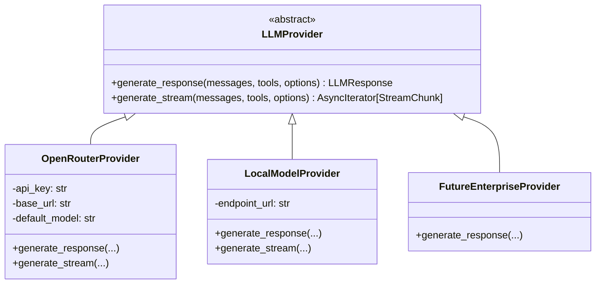
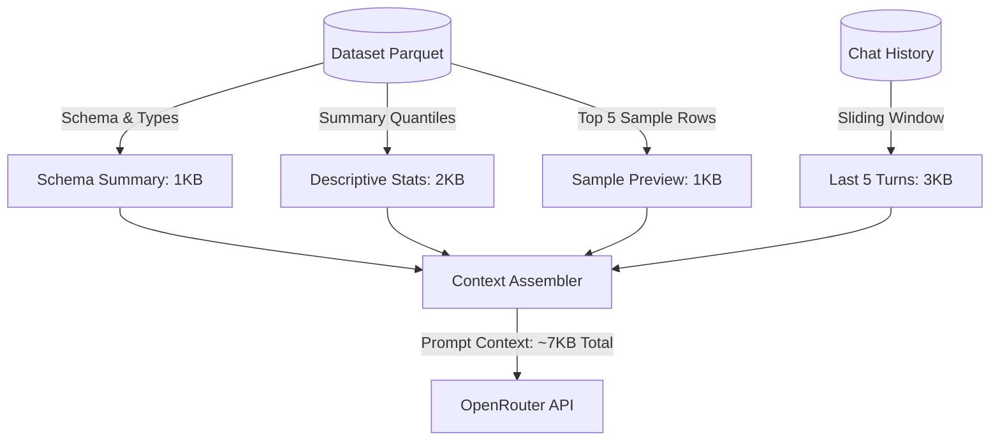

# AnalyzaX — AI Architecture & Orchestration Specification

This document details the LLM abstraction layer, the deterministic tool framework, bounded context injection strategies, and guardrail mechanisms for **AnalyzaX**.

---

## 1. The AI Analyst Philosophy

In AnalyzaX, the Large Language Model acts as an **orchestrator and communicator**, never as a calculation engine.

```
┌─────────────────────────────────────────────────────────────┐
│                       WHAT THE AI DOES                      │
├─────────────────────────────────────────────────────────────┤
│ • Interprets natural language analytical intent             │
│ • Formulates multi-step analytical plans                    │
│ • Selects and invokes deterministic tools                   │
│ • Generates standard SQL queries (subject to AST parsing)   │
│ • Translates raw numbers and metrics into business context  │
│ • Emits declarative ECharts specifications                  │
└─────────────────────────────────────────────────────────────┘

┌─────────────────────────────────────────────────────────────┐
│                    WHAT THE AI NEVER DOES                   │
├─────────────────────────────────────────────────────────────┤
│ ✕ Calculates sums, averages, or medians                     │
│ ✕ Computes correlation coefficients or p-values             │
│ ✕ Fits machine learning algorithms or forecasts             │
│ ✕ Mutates or touches raw dataset files                      │
│ ✕ Generates raw React or JavaScript code                    │
│ ✕ Hallucinates numerical facts without engine verification  │
└─────────────────────────────────────────────────────────────┘
```

---

## 2. LLM Provider Abstraction Layer

The application interacts with LLMs exclusively via an abstract base class (`LLMProvider`) located in `backend/app/engines/ai/provider.py`:



### Provider Directives:
- **Default Provider:** **OpenRouter** (`https://openrouter.ai/api/v1`).
- **Direct Claude API:** Explicitly forbidden. All Claude models are accessed via OpenRouter.
- **ChatGPT Consumer Subscriptions:** Explicitly forbidden as an API backend.
- **Zero Vendor Lock-in:** Swapping providers requires only configuring `LLM_PROVIDER` in `.env` without modifying application services.

---

## 3. The 16 Deterministic AI Tools

The AI operates through an explicit schema-validated tool interface:

| # | Tool Name | Parameters | Deterministic Engine |
| :--- | :--- | :--- | :--- |
| 1 | `inspect_dataset` | `dataset_id`, `version_id` | `profiling` |
| 2 | `get_schema` | `dataset_id`, `version_id` | `profiling` |
| 3 | `get_statistics` | `dataset_id`, `columns` | `statistics` / `eda` |
| 4 | `execute_sql` | `dataset_id`, `query`, `row_limit` | `sql` (DuckDB) |
| 5 | `run_eda` | `dataset_id`, `analysis_type` | `eda` |
| 6 | `detect_outliers` | `dataset_id`, `columns`, `method` | `eda` / `statistics` |
| 7 | `suggest_cleaning` | `dataset_id` | `cleaning` |
| 8 | `apply_cleaning` | `dataset_id`, `operations` | `cleaning` |
| 9 | `create_feature` | `dataset_id`, `feature_spec` | `ml` |
| 10 | `run_regression` | `dataset_id`, `target`, `features` | `ml` |
| 11 | `run_classification`| `dataset_id`, `target`, `features` | `ml` |
| 12 | `run_clustering` | `dataset_id`, `features`, `n_clusters` | `ml` |
| 13 | `forecast` | `dataset_id`, `time_col`, `target`, `horizon` | `forecasting` |
| 14 | `create_chart` | `dataset_id`, `chart_type`, `x`, `y`, `title` | `visualization` |
| 15 | `create_dashboard` | `dataset_id`, `widget_specs` | `dashboard` |
| 16 | `export_result` | `dataset_id`, `format`, `target_object` | `export` |

---

## 4. Bounded Context Injection Architecture

Sending entire raw datasets to an LLM is **forbidden** by the Development Constitution (AGENTS.md). AnalyzaX constructs a compact, bounded context packet:



### Context Packet Structure
1. **Dataset Metadata:** Name, row count, column count, active version ID.
2. **Schema Table:** Column names, physical data types, inferred semantic types, and null percentages.
3. **Five Sample Rows:** Formatted as Markdown or compact JSON rows for concrete visual grounding.
4. **Recent Query / Execution Output:** When answering follow-up questions, inject the output of the most recent SQL or tool execution.

---

## 5. Declarative Visualization Generation

The AI is strictly prohibited from writing React JSX, canvas scripts, or HTML. Instead, it generates a typed JSON specification matching the `VisualizationSpec` schema:

```json
{
  "type": "bar",
  "title": "Quarterly Revenue by Region",
  "data_source": {
    "type": "sql_result",
    "query": "SELECT region, SUM(revenue) AS total_revenue FROM dataset GROUP BY region"
  },
  "encoding": {
    "x": { "field": "region", "type": "nominal", "title": "Sales Region" },
    "y": { "field": "total_revenue", "type": "quantitative", "title": "Revenue (USD)", "format": "$," }
  },
  "theme": {
    "palette": "modern_teal",
    "show_legend": true
  }
}
```

The frontend visualization component passes this specification to the Apache ECharts runtime, ensuring consistent styling, responsiveness, and zero code execution vulnerabilities.

