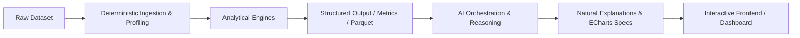
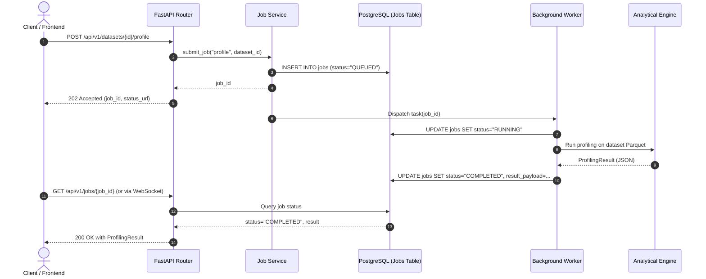

# AnalyzaX — System Architecture Specification

## 1. System Overview

AnalyzaX is an AI-powered, end-to-end data analytics platform designed to bridge the gap between raw, messy data and executive-ready decisions. Unlike traditional BI tools that demand pre-modeled semantic schemas or naïve LLM wrappers that fabricate numerical conclusions, AnalyzaX enforces a **deterministic-first, AI-reasoning architecture**.

### Core Architecture Flow



### The Non-Negotiable Principle

```
Dataset ➔ Deterministic Processing ➔ Analytical Engines ➔ Structured Results ➔ AI Reasoning ➔ Explanation ➔ Visualization
```

The Large Language Model (LLM) is **never** permitted to calculate sums, averages, variances, correlations, p-values, or forecasts directly. All numbers displayed in AnalyzaX originate from deterministic engines (DuckDB, Polars, SciPy, scikit-learn, statsmodels). The LLM functions strictly as:
- An empathetic, knowledgeable analyst
- A high-level planner and orchestrator
- An intent-to-SQL translator (subject to AST validation)
- A context-aware result explainer
- A visualization recommender

---

## 2. Layer Separation & Responsibilities

The system is organized into four strictly decoupled tiers:

```mermaid
graph TD
    subgraph Presentation_Layer["Presentation Layer (Next.js + TypeScript + Tailwind + shadcn/ui)"]
        UI_Upload[Upload & Ingestion Views]
        UI_Profile[Data Health & Lineage View]
        UI_EDA[Automated EDA & Deep Dive]
        UI_SQL[SQL Studio & Results Grid]
        UI_Chat[AI Analyst Copilot]
        UI_Dash[Dynamic Dashboard Canvas]
    end

    subgraph Transport_Layer["API & Transport Layer (FastAPI)"]
        Router[REST Endpoints & SSE / WebSocket Hub]
        Auth[Auth & Permissions Middleware]
        RateLimit[Rate Limiting & Request Validation]
    end

    subgraph Service_Layer["Application Service Layer"]
        DatasetService[Dataset & Version Service]
        JobService[Async Job Orchestrator]
        LineageService[Lineage & Audit Service]
        AIService[AI Prompt & Tool Orchestrator]
        ExportService[Export & Packaging Service]
    end

    subgraph Engine_Layer["Analytical Engine Layer (Pure Deterministic Python)"]
        E_Ingest[Ingestion Engine]
        E_Prof[Profiling Engine]
        E_Clean[Cleaning Engine]
        E_EDA[EDA Engine]
        E_Stats[Statistics Engine]
        E_SQL[SQL Engine (DuckDB)]
        E_ML[Machine Learning Engine]
        E_FC[Forecasting Engine]
        E_Viz[Visualization Engine]
        E_Exp[Export Engine]
        E_AI[AI Abstraction Engine]
    end

    subgraph Storage_Layer["Storage & Execution Layer"]
        PG[(PostgreSQL - Metadata & Lineage)]
        Duck[(DuckDB In-Process Analytical Engine)]
        FS[Filesystem: Parquet Lake / Uploads / Exports]
        Cache[(Redis - Job Queues & Hot Caches)]
    end

    Presentation_Layer --> Transport_Layer
    Transport_Layer --> Service_Layer
    Service_Layer --> Engine_Layer
    Engine_Layer --> Storage_Layer
```

### Layer Responsibilities

1. **Presentation Layer (Frontend):**
   - Built on Next.js (App Router), React, TypeScript, Tailwind CSS, and shadcn/ui.
   - Strictly handles user interactions, rendering of structured data tables, chart visualization via Apache ECharts, and responsive AI chat dialogues.
   - **Zero business or analytical logic** is executed in the frontend.

2. **API & Transport Layer (FastAPI):**
   - Pure HTTP and WebSocket/SSE interfaces.
   - Enforces request validation using Pydantic schemas, file size constraints, and session authentication.
   - **Zero analytical computation** occurs in route handlers; all tasks are immediately delegated to the Service Layer.

3. **Application Service Layer:**
   - Coordinates multi-engine workflows (e.g., executing cleaning, updating lineage, dispatching async profiling tasks).
   - Manages transactional boundaries in PostgreSQL for dataset metadata and job lifecycle statuses.
   - Prepares bounded, token-efficient context packets for the AI Engine.

4. **Analytical Engine Layer:**
   - Stateless, modular Python packages under `backend/app/engines/`.
   - Each engine has single responsibility and receives typed configuration inputs, operating directly on Parquet files, Arrow tables, or DuckDB views, returning typed structured output.

5. **Storage & Execution Layer:**
   - **PostgreSQL:** Stores user profiles, workspace metadata, dataset registers, transformation lineage logs, job queues, and dashboard definitions. **Never** stores raw row-level dataset records.
   - **DuckDB:** In-process, high-performance vectorized SQL analytical database engine executing analytical queries over Parquet files.
   - **Local / Object Storage:** Structured directory tree housing original immutable uploads, cleaned Parquet versions, temporary scratch files, and compiled export artifacts.

---

## 3. Modular Analytical Engines

Each engine in `backend/app/engines/` is decoupled and individually testable:

| Engine | Primary Technologies | Core Purpose & Operations |
| :--- | :--- | :--- |
| **`ingestion`** | Polars, python-magic | Format detection (CSV, Parquet, JSON, Excel), encoding resolution, raw integrity checks, conversion to columnar Parquet format. |
| **`profiling`** | Polars, DuckDB | Column classification (numerical, categorical, datetime, text, ID), null counts, cardinality, memory footprint, basic distributions. |
| **`cleaning`** | Polars | Deterministic transformations: deduplication, null imputation (mean, median, mode, constant), type casting, string stripping, outlier clipping. |
| **`eda`** | Polars, SciPy | Automated descriptive statistics, quantile calculations, skewness, kurtosis, correlation matrices (Pearson, Spearman), distribution histograms. |
| **`statistics`** | SciPy, statsmodels | Parametric and non-parametric hypothesis testing (t-test, ANOVA, Mann-Whitney, Chi-Square), regression diagnostics, normality testing (Shapiro-Wilk). |
| **`sql`** | DuckDB, sqlglot | AST-based query validation, SQL sanitization, execution against Parquet representations, strict timeout and memory containment. |
| **`ml`** | scikit-learn | Automated task detection (Regression, Classification, Clustering), baseline model benchmarking (Random Forest, Ridge, Logistic Regression), feature importance. |
| **`forecasting`** | statsmodels, sktime (future) | Datetime frequency detection, missing timestamp imputation, stationarity tests (ADF), ARIMA/ETS/Exponential Smoothing, confidence interval derivation. |
| **`visualization`** | Pydantic | Translates analytical summaries into declarative ECharts JSON specifications (bar, line, scatter, boxplot, heatmap, radar). |
| **`export`** | Polars, openpyxl, reportlab | Compiles processed datasets, summary reports, and query outputs into CSV, Excel, Parquet, JSON, or executive PDF briefs. |
| **`ai`** | httpx, Pydantic | Abstracted interface to LLMs (OpenRouter), tool invocation protocol, prompt template compilation, structured JSON extraction. |

---

## 4. Repository Structure & Rationale

```
AnalyzaX-x/
├── frontend/                     # Next.js 14+ App Router, TypeScript, Tailwind CSS
│   ├── app/                      # Page routes (datasets, eda, sql, ml, dashboard)
│   ├── components/
│   │   ├── ui/                   # shadcn/ui primitives (button, modal, toast)
│   │   ├── layout/               # App layout, sidebars, headers, breadcrumbs
│   │   ├── dataset/              # Dataset tables, schema viewers, lineage tree
│   │   ├── dashboard/            # Grid canvas, widget cards, drag/drop frames
│   │   ├── charts/               # ECharts wrappers and specialized chart renderers
│   │   ├── tables/               # Virtualized data grids for large datasets
│   │   └── chat/                 # AI Analyst conversational sidebar & tool cards
│   ├── hooks/                    # Custom React hooks (useDataset, useJobStatus)
│   ├── lib/                      # Client utilities, formatters, chart theme tokens
│   ├── services/                 # Typed API client functions for backend calls
│   ├── types/                    # Shared TypeScript interfaces matching backend schemas
│   └── styles/                   # Global CSS, theme variables, typography
├── backend/                      # Python FastAPI application
│   ├── app/
│   │   ├── api/                  # FastAPI routers (v1 endpoints)
│   │   │   ├── v1/               # Versioned routes (datasets, jobs, eda, sql, ai)
│   │   │   └── deps.py           # Dependency injection (DB session, auth, storage)
│   │   ├── core/                 # Config, security, logging, error handlers
│   │   ├── models/               # SQLAlchemy/SQLModel metadata models (PostgreSQL)
│   │   ├── schemas/              # Pydantic schemas (request/response validation)
│   │   ├── services/             # Application workflows and orchestrators
│   │   ├── engines/              # The 11 modular analytical engines
│   │   │   ├── ingestion/
│   │   │   ├── profiling/
│   │   │   ├── cleaning/
│   │   │   ├── eda/
│   │   │   ├── statistics/
│   │   │   ├── sql/
│   │   │   ├── ml/
│   │   │   ├── forecasting/
│   │   │   ├── visualization/
│   │   │   ├── export/
│   │   │   └── ai/
│   │   ├── utils/                # File helpers, hashing, datetime parsing
│   │   └── main.py               # FastAPI application entrypoint and lifespan
│   ├── tests/                    # Backend test suite (mirrored by engine)
│   ├── Dockerfile
│   └── requirements.txt
├── data/                         # Local storage root (git-ignored)
│   ├── uploads/                  # Immutable original uploaded files
│   ├── processed/                # Versioned Parquet files (v1, v2...)
│   ├── exports/                  # Generated CSV, Excel, PDF artifacts
│   └── temp/                     # Scratch workspace and DuckDB spill files
├── tests/                        # End-to-end and cross-cutting integration tests
├── docs/                         # Complete architecture and specifications
├── scripts/                      # Setup, DB migration, test dataset generation scripts
├── .env.example                  # Environment variable blueprint
├── .gitignore                    # Git exclusions
├── README.md                     # Project master documentation
├── AGENTS.md                     # Development constitution & coding rules
└── docker-compose.yml            # Local development orchestration
```

### Architectural Improvement Justification
- **Dedicated `schemas/` vs `models/` separation:** Models represent persistent PostgreSQL metadata (using SQLAlchemy/SQLModel); Schemas represent transient Pydantic contracts for APIs and engine inputs/outputs.
- **Engine-to-Test mirroring:** Every sub-engine in `backend/app/engines/<name>/` has a corresponding test package `backend/tests/engines/test_<name>.py` to enforce high testability.

---

## 5. Background Job & Asynchronous Execution Architecture

Data profiling, ML training, forecasting, and large SQL queries can easily exceed typical HTTP request timeouts (10-30s). To preserve responsiveness:



### Job States
- `QUEUED`: Job received and waiting for worker allocation.
- `RUNNING`: Actively executing inside an analytical engine. Includes `progress_percentage` (0-100) and `step_description`.
- `COMPLETED`: Finished successfully; output stored in PostgreSQL or Parquet storage.
- `FAILED`: Execution terminated with error; error message and stack trace securely logged.
- `CANCELLED`: Interrupted by user request.

---

## 6. Open Architectural Decisions & Risks

### Architectural Risks
1. **Memory Pressure with Large Datasets:** While DuckDB handles out-of-core memory paging gracefully, Polars operations (e.g., eager pivots or complex regex cleaning) could trigger OOM on worker containers if datasets exceed 10GB.
   *Mitigation:* Enforce strict streaming APIs in Polars (`scan_parquet`) and memory limits (`DUCKDB_MEMORY_LIMIT`).
2. **SQL Injection / Hostile DuckDB Queries:** Even in an analytical database, malicious commands (e.g., `INSTALL`, `LOAD`, or reading unauthorized filesystem paths via `read_parquet`) can compromise system isolation.
   *Mitigation:* Implement strict AST inspection through `sqlglot`, whitelist read-only clauses (`SELECT`, `JOIN`, `WHERE`, `GROUP BY`), and explicitly disable filesystem reading extensions inside DuckDB connections.
3. **LLM Tool Selection Hallucination:** The AI might invent non-existent column names or tool parameters.
   *Mitigation:* Inject explicit Pydantic JSON schemas into OpenRouter calls and validate tool call arguments prior to execution. If validation fails, return structured errors to the LLM for self-correction.

### Open Architectural Decisions
---

## 7. Machine Learning Engine Architecture (Phase 11)

### Non-Negotiable Machine Learning Principles
1. **Zero LLM Numerical Computation:** Model training, evaluations, predictions, feature importances, and diagnostic metrics are computed strictly using deterministic Python libraries (`scikit-learn`, `numpy`, `scipy`). The LLM never computes or adjusts ML results.
2. **Strict Dataset Version Isolation:** Every ML experiment, model run, and prediction is explicitly bound to immutable `(dataset_id, dataset_version_id)` pairs.
3. **Data Leakage Prevention:** Preprocessing pipelines (`ColumnTransformer`) are fit **only** on the training split. Cross-validation independently fits preprocessing within each fold.
4. **Central Model Registry:** 13 scikit-learn estimators + 2 baseline estimators with declarative parameter schemas, capability flags, and validation rules.
5. **Safe Model Artifacts:** Persisted via `joblib` with SHA-256 integrity verification, safe path traversal protection, and strict schema compatibility checks before inference.
6. **Visualization Standard:** ML diagnostics (ROC curves, PR curves, Confusion Matrices, Actual vs Predicted, Residual Distributions, Feature Importance) map directly to Phase 9 `ChartSpec` contracts without introducing separate charting dependencies.

```mermaid
flowchart TD
    DS[Immutable Dataset Version] --> Suit[ML Suitability Analyzer]
    Suit --> Split[Deterministic Splitter (Stratified / K-Fold)]
    Split --> TrainData[Training Split]
    Split --> ValData[Validation / Test Split]
    TrainData --> Preproc[Preprocessing Pipeline (Fit strictly on Train)]
    Preproc --> Reg[Model Registry (13 Algorithms + 2 Baselines)]
    Reg --> Train[Model Trainer / Hyperparameter Search]
    Train --> Eval[Evaluation Engine (Task-Aware Metrics)]
    ValData --> PreprocTest[Transform Validation / Test]
    PreprocTest --> Eval
    Eval --> Interp[Interpretation Engine (Feature Importance)]
    Eval --> Diag[Diagnostics Engine (ROC, PR, Residuals, Confusion)]
    Diag --> Chart[Phase 9 ChartSpec Visualizer]
    Train --> Artifact[Safe Artifact Persistence (SHA-256 Manifest)]
    Artifact --> Infer[Inference Engine]
```

---

## 8. Time-Series Forecasting Engine Architecture (Phase 12)

### Non-Negotiable Time-Series & Forecasting Principles
1. **Forecasting Is NOT Tabular Regression:** Time series models require explicit temporal semantics, frequency inference, calendar boundary awareness, and strictly chronological operations.
2. **Zero Temporal Leakage:** Random train/test splitting and row shuffling are strictly prohibited. All train/test boundaries and rolling-origin walk-forward folds strictly enforce:
   $$\max(T_{\text{train}}) < \min(T_{\text{test}})$$
3. **Zero LLM Numerical Computation:** All frequency detection, ACF/PACF calculations, decompositions, model fittings, predictions, and residual diagnostics are executed via deterministic analytical libraries (`statsmodels`, `polars`, `numpy`, `scipy`).
4. **Central Forecasting Model Registry:** 8 statistical estimators (`Naive`, `Seasonal Naive`, `Drift`, `Simple Exponential Smoothing`, `Holt's Linear Trend`, `Holt-Winters Exponential Smoothing`, `ARIMA(p,d,q)`, `SARIMAX(p,d,q)(P,D,Q)_m`) with declarative parameter schemas, capability flags, and validation rules.
5. **Rolling-Origin Walk-Forward Backtesting:** Models are evaluated across chronological backtest folds with bounded history. Performance is never evaluated against in-sample training data.
6. **Prediction Intervals:** Models produce defensible uncertainty bands (90%, 95%, 99% confidence levels) calculated via analytical formula or statsmodels forecast variances.
7. **Safe Model Artifacts:** Refitted forecasting models are persisted with SHA-256 integrity verification, safe path traversal protection, and schema compatibility checks before future inference.
8. **Phase 9 ChartSpec Integration:** All forecasting visualizations (Historical + Forecast with shaded prediction intervals, Backtest Predictions, Residuals, Model Comparison, Seasonal Decomposition, ACF) map directly to Phase 9 `ChartSpec` contracts rendered via `ChartRenderer`.

```mermaid
flowchart TD
    DS[Immutable Dataset Version] --> Val[Temporal Validation & Frequency Detection]
    Val --> RegCheck[Regularity & Missing/Duplicate Timestamp Audit]
    RegCheck --> Diag[Temporal Diagnostics (Trend, Seasonality, ACF/PACF, STL)]
    Diag --> Split[Chronological Splitter & Rolling-Origin Backtesting]
    Split --> TrainFold[Train Folds]
    Split --> TestFold[Test Folds]
    TrainFold --> ModelReg[Central Forecasting Registry (8 Estimators)]
    ModelReg --> Fit[Walk-Forward Model Backtesting]
    Fit --> TestFold
    TestFold --> Metric[Evaluation Engine (MAE, RMSE, sMAPE, WAPE, MASE)]
    Metric --> Comp[Model Leaderboard & Baseline Comparison]
    Comp --> Refit[Full History Model Refit]
    Refit --> Interval[Prediction Intervals (90%, 95%, 99%)]
    Interval --> Point[Point & Interval Projections]
    Refit --> ResDiag[Residual Diagnostics (Ljung-Box, Normality)]
    ResDiag --> Find[Deterministic Forecast Findings]
    Point --> Chart[Phase 9 ChartSpec Visualizer]
    Refit --> Artifact[Safe Model Artifact (SHA-256 Manifest)]
    Artifact --> FutureInfer[Out-of-Sample Future Inference Engine]
```

---

## 9. AI Analyst & Natural-Language Orchestration Architecture (Phase 13)

### Non-Negotiable AI Analyst Principles
1. **The LLM Is NOT a Calculation Engine:** The LLM never computes averages, correlations, quantiles, p-values, ML loss, or forecasts. All calculations are executed by registered deterministic engines (Phases 1–12).
2. **Provider Abstraction:** The `LLMProvider` interface abstracts external gateways (`OpenRouterProvider`) and local offline fallbacks (`MockLLMProvider`), enabling complete offline testing and CI compatibility.
3. **Strict Tool Permissions:** Registered tools are classified into `READ_ONLY`, `DERIVED_RESULT`, and `PROPOSAL_ONLY`. No destructive cleaning is executed without human-in-the-loop confirmation.
4. **Answer Grounding & Hallucination Prevention:** An automated `AnswerValidator` traces numerical claims to tool result citations (`AnalysisReference`). Failed tools are never masked as successes.
5. **Causality & Safety Filters:** `CausalityGuard` prevents observational causal claims ("causes", "drives") and replaces them with scientific association terminology ("associated with", "correlated with"). `SecretFilter` redacts credentials and API keys.

```mermaid
flowchart TD
    UserQuery[User Question] --> Guard[Prompt Injection & Secret Guard]
    Guard --> Intent[Structured Intent Classifier (23 Intents)]
    Intent --> Planner[Analysis Planner & Step Dependency Graph]
    Planner --> ToolLoop[Tool Execution Loop (Max 8 Calls)]
    
    subgraph Registered_Tools["Central Tool Registry (16 Tools)"]
        T_Profile[get_profile]
        T_Quality[get_quality_report]
        T_SQL[execute_sql]
        T_Stats[run_statistical_analysis]
        T_ML[run_ml_experiment]
        T_FC[run_forecast]
        T_Viz[create_visualization]
        T_Clean[propose_cleaning]
    end
    
    ToolLoop --> Registered_Tools
    Registered_Tools --> Results[Structured Tool Results & Metrics]
    Results --> Grounding[Answer Validator & Evidence Citations]
    Grounding --> Causality[Causality & Secret Safety Filter]
    Causality --> Response[Grounded Answer + Phase 9 ChartSpec + Follow-ups]
    Response --> Session[Session JSON Persistence & Context Memory]

---

## 10. Dashboard, Insight Workspace, and Analytical Storytelling (Phase 14)

### Core Architectural Mandates:
1. **Composition & Presentation Boundary:** The dashboard layer owns layout, grid orchestration, presentation, narrative, and filter propagation. It is strictly **NOT** an analytical engine.
2. **Zero Custom Analytical Computation:** All metrics, hypothesis tests, ML evaluations, and forecasts are generated by deterministic domain engines (Phases 3–13).
3. **Analytical Truth & Population Safety:**
   - Filters applied to visualizations and tables dynamically re-query bounded parquet rows via DuckDB.
   - Filters applied to statistical or ML components **never** synthesize modified statistics or claim retrained metrics; they display the certified experiment baseline and explicitly flag that recomputation is required.
4. **Phase 9 ChartSpec Reuse:** Chart components embed Phase 9 `ChartSpec` objects and render via the shared `ChartRenderer` — no duplicate charting or ECharts configurations exist.
5. **Version Snapshots & Optimistic Concurrency:** Dashboard updates maintain an audit trail of version snapshots (`./data/dashboards/history/{id}/v{n}.json`) and utilize SHA-256 configuration hashes to detect concurrent editing conflicts.

```mermaid
flowchart TD
    subgraph Analytical_Engines["Deterministic Analytical Engines (Phases 3–13)"]
        Eng_SQL[DuckDB SQL Engine]
        Eng_Viz[Phase 9 Visualization Preparer]
        Eng_Stats[Phase 10 Statistics Engine]
        Eng_ML[Phase 11 ML Studio]
        Eng_FC[Phase 12 Forecasting Engine]
        Eng_AI[Phase 13 AI Analyst Agent]
    end

    subgraph Dashboard_Core["Phase 14 Dashboard Domain & Application Service"]
        D_Aggregate[Dashboard Aggregate & 12-Col Grid Layout]
        D_FilterBar[Global Filter Bar & Cross-Filtering Router]
        D_Hydrator[Deterministic Component Hydrator & Stale Guard]
        D_Security[Security Sanitizer & Resource Limit Validator]
        D_History[Version History & Concurrency Hasher]
    end

    subgraph Frontend_Workspace["Next.js Presentation Studio (/dashboard)"]
        UI_Grid[12-Column Responsive Grid Canvas]
        UI_Cards[Component Cards & Widget Library]
        UI_Provenance[Source & Provenance Inspector Modal]
        UI_Drawers[Config Drawer & History Rollback Drawer]
    end

    Analytical_Engines --> D_Hydrator
    D_FilterBar --> D_Hydrator
    D_Security --> D_Aggregate
    D_Aggregate --> D_History
    D_Hydrator --> D_Aggregate
    D_Aggregate --> UI_Grid
    UI_Grid --> UI_Cards
    UI_Cards --> UI_Provenance
    UI_Cards --> D_FilterBar
```

