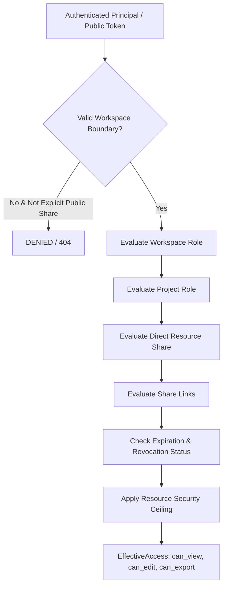

# AnalyzaX — Collaboration, Sharing & Access Management Architecture (Phase 18)

## 1. Executive Summary & Core Principle

The collaboration system in AnalyzaX enables multi-user teams to securely share analytical assets without compromising data privacy, reproducibility, or tenant isolation.

> **Fundamental Collaboration Principle:**  
> **Sharing grants ACCESS; it does NOT duplicate analytical assets.**  
> When a dataset, dashboard, report, visualization, or ML experiment is shared, recipient users interact with the authoritative analytical asset according to explicit permissions. The system never creates duplicate datasets, duplicate database tables, or duplicate models unless an explicit clone action is initiated.

---

## 2. Access Precedence & Effective Access Model

Access resolution follows a strict, centralized precedence hierarchy:



### 2.1 Resolution Hierarchy
1. **Workspace Boundary:** Users outside a workspace cannot access project or dataset assets unless an explicit external share is active with legitimate share scope.
2. **Project Boundary:** Project membership is invariant-bound; no user can be a `ProjectMember` without active membership in the parent `Workspace`.
3. **Direct Shares (`ResourceShare`):** Resource-scoped permissions (`VIEW`, `EDIT`, `EXPORT`). A direct share elevates access only up to the ceiling permitted for the underlying asset.
4. **Share Links (`ShareLink`):** Cryptographic single-use or multi-use URL tokens. Supports `INTERNAL_AUTHENTICATED` (default) and `PUBLIC_READ_ONLY` (restricted presentation mode).
5. **Effective Access Resolver (`AccessService.resolve_effective_access`):**
   - Returns structured `EffectiveAccess` containing boolean flags (`can_view`, `can_edit`, `can_export`), active `access_sources`, `expires_at`, and `restrictions`.
   - Results are cached in thread-safe TTL cache and immediately invalidated upon membership, role, or share changes.

---

## 3. Workspace Invitations & Lifecycle

### 3.1 Invitation Security Architecture
- **Cryptographic Entropy:** Tokens generated using `secrets.token_urlsafe(32)`.
- **Zero Raw Storage:** Only SHA-256 hashes (`token_hash`) are stored in persistence. Raw tokens are never logged or exposed in general API lists.
- **Single-Use & Time-Limited:** Default 7-day expiration. Upon acceptance, the token is consumed and marked `ACCEPTED`.
- **Resend Invalidation:** Resending an invitation invalidates previous token hashes and generates a fresh secret without creating duplicate invitations.

### 3.2 Invitation Lifecycle States
```
  [PENDING] ────► [ACCEPTED] (Creates WorkspaceMember)
      │
      ├───► [REVOKED]  (Explicit Admin Revocation)
      │
      └───► [EXPIRED]  (Evaluated on Resolution)
```

---

## 4. Resource Sharing & Permission Boundaries

### 4.1 Supported Resource Types
- `DATASET` & `DATASET_VERSION`
- `DASHBOARD`
- `REPORT`
- `VISUALIZATION`
- `QUERY` (SQL)
- `STATISTICAL_RESULT`
- `ML_RESULT`
- `FORECAST_RESULT`
- `AI_ANALYSIS`
- `EXPORT`

### 4.2 Initial Share Permissions
- `VIEW`: Read-only presentation.
- `EDIT`: Modification of layout, query text, or parameters. Does NOT grant dataset modification or workspace administration.
- `EXPORT`: Permission to download CSV, Parquet, or PDF summaries. **VIEW does not imply EXPORT.**

---

## 5. Share Links & Public Read-Only Security

Share links decouple anonymous/external presentation from internal platform infrastructure:
1. **Isolated Presentation (`/shared/{token}`):** Renders minimal, clean views without global navigation, member directories, or project administration bars.
2. **Component Dependency Masking:** When a dashboard contains widgets whose underlying datasets are not accessible to the viewer, the system suppresses private metadata and renders a controlled alert:
   > *"Some dashboard content is unavailable due to access restrictions."*
3. **No Leakage:** Database credentials, internal entity paths, and hidden tool outputs are strictly stripped before returning JSON representations.

---

## 6. Integration with Analytical Engines

- **Search Security:** `SearchService` dynamically filters matching assets using `AccessService.resolve_effective_access(user_id, resource_type, asset_id)`. Assets without `can_view` are filtered server-side.
- **Lineage Privacy:** `DependencyAnalyzer.build_lineage_graph` sanitizes upstream inaccessible nodes into generic `Restricted source` nodes with empty metadata.
- **SQL Security:** Sharing a saved query definition does NOT grant implicit access to underlying datasets. Query execution and data preview enforce independent dataset permissions.
- **AI Analyst Security:** LLM tool calls execute under the requesting user's security context; the LLM is never treated as an authorization mechanism.
- **Export Security:** Export generation checks `can_export` independently of `can_view`.

---

## 7. Future Extension Points
The collaboration system is architected to cleanly support future phases:
- **Real-Time Presence & WebSockets:** Extensible via collaboration event stream.
- **Contextual Comments & Threads:** Anchored to `ResourceShare` entities.
- **External Notifications (SMTP / Slack / Teams):** Implemented by providing alternative `NotificationProvider` backends to `InvitationDeliveryService`.
- **Enterprise SSO & SCIM Directory Sync:** Hooks exist in `WorkspaceMember` lifecycle.
