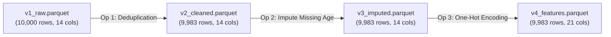
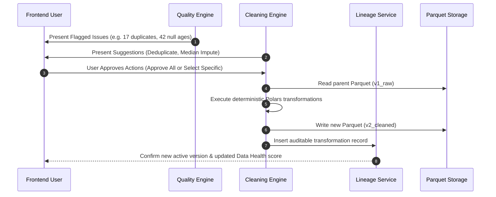
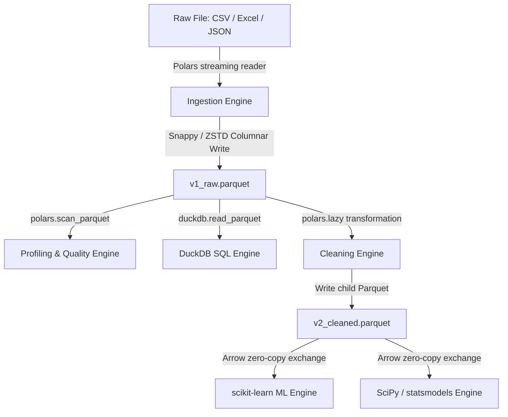

# AnalyzaX — Data Pipeline & Storage Architecture

This document defines the storage layout, dataset lifecycle, immutable versioning scheme, lineage DAG, and deterministic processing pipelines for **AnalyzaX**.

---

## 1. Dataset Identity & Metadata Model

Every uploaded dataset receives an immutable, globally unique Dataset Identifier:
```
ds_<8-character-hex-hash>   (e.g., ds_8f72ab91)
```

### Tracked Dataset Attributes (Stored in PostgreSQL)
1. **Identifiers:** `dataset_id`, `project_id`, `user_id`.
2. **File Origin:** `original_filename`, `file_format` (`csv`, `parquet`, `xlsx`, `json`), `file_size_bytes`, `md5_checksum`, `upload_timestamp`.
3. **Storage Paths:** `raw_file_path`, `active_version_id`, `active_parquet_path`.
4. **Structural Metrics:** `row_count`, `column_count`, `memory_footprint_bytes`.
5. **Schema & Semantic Typing:** Column names, physical types (`Int64`, `Float64`, `Utf8`, `Datetime`), inferred semantic roles (`ID`, `Numerical`, `Categorical`, `Temporal`, `Text`, `Target`).
6. **Analytical Snapshots:** Foreign keys to latest `ProfilingResult`, `DataQualityReport`, and `TransformationHistory`.

---

## 2. Storage Organization on Disk

All file-based assets are organized under a deterministic directory structure:

```
data/
├── uploads/
│   └── ds_8f72ab91/
│       └── raw_customers_export.csv          <-- IMMUTABLE RAW UPLOAD
├── processed/
│   └── ds_8f72ab91/
│       ├── v1_raw.parquet                    <-- Initial columnar conversion
│       ├── v2_cleaned.parquet                <-- Post-cleaning transformation
│       └── v3_feature_engineered.parquet     <-- Post-feature engineering
├── exports/
│   └── ds_8f72ab91/
│       ├── exp_01h8a9b2_cleaned.xlsx
│       └── exp_01h8a9b3_summary.pdf
└── temp/
    ├── duckdb/                               <-- DuckDB scratch buffer & spilling
    └── scratch/                              <-- Transient intermediate buffers
```

### Storage Invariants
- **Original Upload Immutability:** Files in `data/uploads/` are write-protected once uploaded and never altered or overwritten.
- **Columnar Standard:** All analytical engines operate exclusively on Parquet files stored in `data/processed/`.
- **Zero Raw Data in PostgreSQL:** PostgreSQL stores only relational metadata, job states, JSON lineage trees, and summary profiles.
- **Profiling Cache Persistence:** Persistent JSON profiles reside in `data/profiles/{dataset_id}/profile.json` with version tracking (`profiling_version: "profile_v1"`).

---

## 2.1 Automated Dataset Profiling & Semantic Understanding

```mermaid
flowchart TD
    Ready[Dataset Status: READY] --> Service[ProfilingService]
    Service --> CacheCheck{Profile Cached?}
    CacheCheck -- Yes --> ReturnCache[Return Persistent Profile]
    CacheCheck -- No / Refresh --> DuckDBEngine[DuckDB Vectorized Scan]
    
    DuckDBEngine --> Phys[Physical Type Extraction]
    DuckDBEngine --> Num[Numerical Metrics & Quantiles]
    DuckDBEngine --> Cat[Categorical Distribution & Top Categories]
    DuckDBEngine --> Date[Temporal Bounds & Cadence]
    
    Phys & Num & Cat & Date --> Semantic[Multi-Signal Semantic Type Inference]
    Semantic --> Targets[Target Candidate Classifier]
    Targets --> Persist[Persist data/profiles/{dataset_id}/profile.json]
    Persist --> UI[Frontend Dataset Intelligence Display]
```

### Semantic Taxonomy & Confidence Matrix
AnalyzaX applies a controlled semantic classification taxonomy with calibrated confidence scores (0.0 to 1.0):
1. **Identifiers (`identifier`):** Uniqueness $\ge 95\%$ combined with naming cues (`id`, `uuid`, `key`, `code`) or 100% unique primary keys.
2. **Monetary (`monetary`):** Numeric types with monetary cues (`revenue`, `sales`, `price`, `cost`, `salary`) and non-negative bounds.
3. **Percentage & Ratio (`percentage`, `ratio`):** Normalized floats in $[0, 1]$ (ratio) or $[0, 100]$ (percentage) with rate/margin keywords.
4. **Dates & Temporals (`date`, `datetime`, `time`):** Native timestamp types or parseable ISO strings with cadence inference (`hourly`, `daily`, `weekly`, `monthly`, `quarterly`, `yearly`, `irregular`).
5. **Specialized Formats (`email`, `url`, `phone`):** Regex pattern density $\ge 80\%$ on string columns.
6. **Geographic Coordinates (`geographic_latitude`, `geographic_longitude`):** Bounded $[-90, 90]$ and $[-180, 180]$ floats with coordinate naming cues.
7. **Booleans (`boolean`):** Binary flags (`0/1`, `true/false`, `yes/no`).
8. **Unstructured Text (`text`):** High string length ($> 45$ average, $> 150$ max) and high cardinality, distinguishing from discrete categories.

### Target Variable Candidate Detection
- **Binary Classification:** 2 discrete classes, non-identifier, non-constant.
- **Multiclass Classification:** 3 to 15 discrete classes, balanced cardinality ratio $< 0.2$.
- **Continuous Regression:** Numerical float/int with variance $> 0$, uniqueness $> 15$, and target keyword affinity.

---

## 2.2 Automated Data Quality Engine (Phase 5)

The Data Quality Engine operates downstream of ingestion and profiling. It is strictly read-only, deterministic, and modular:

```mermaid
flowchart TD
    Profile[Dataset Profile] --> QualityEngine[DataQualityEngine]
    DuckDB[(DuckDB In-Memory View)] --> QualityEngine

    subgraph QualityRules[Modular Quality Rules]
        R1[CompletenessRule: Missing, Empty Rows, Blank Strings]
        R2[DuplicatesRule: Full-Row Duplicate Detection]
        R3[IdentifiersRule: Null Keys & Collision Auditing]
        R4[TypeConsistencyRule: Mixed Types, Constant Columns]
        R5[RangeValidationRule: [0, 100], Lat/Lon, Negatives]
        R6[CategoryConsistencyRule: Casing & Whitespace]
        R7[FormatValidationRule: Email, URL, Date Parsing]
        R8[OutlierRiskRule: Tukey IQR Anomaly Risk]
    end

    QualityEngine --> QualityRules
    QualityRules --> Scorer[QualityScorer: Deterministic Scoring Model]
    Scorer --> PersistReport[data/quality/{id}/report.json (quality_v1)]
    PersistReport --> UI[Frontend /data-quality Dashboard]
```

### Quality Dimensions & Weighting
- **Completeness (25% weight):** Assesses missing rates, completely empty rows, 100% null columns, and blank string values (`""`, `" "`).
- **Validity (25% weight):** Validates percentage bounds $[0, 100]$, geographic coordinates, strictly non-negative domains, and parseable date/numeric types.
- **Uniqueness (20% weight):** Detects identical full-row duplicates across all dimensions.
- **Consistency (15% weight):** Detects categorical casing conflicts (e.g. `Male` vs `male`), unstripped leading/trailing whitespaces.
- **Integrity (10% weight):** Audits primary key candidates for nulls and collision duplicates.
- **Anomaly Risk (5% weight):** Evaluates statistical outlier frequency outside Tukey fences ($Q1 - 1.5 \times IQR$ and $Q3 + 1.5 \times IQR$).

### Deterministic Penalty Model
- Each dimension score begins at `100.0`.
- Deductions are applied per detected issue: `CRITICAL` (-20), `HIGH` (-10), `MEDIUM` (-4), `LOW` (-1), `INFO` (0), scaled by affected row percentages.
- Dimension scores and overall score are clamped to $[0.0, 100.0]$.

---

## 3. Data Versioning & Lineage Architecture

AnalyzaX rejects destructive in-place mutations. Every approved cleaning, imputation, or feature engineering action spawns an immutable child version:



### Structured Lineage Record Schema

Each edge in the transformation DAG is recorded in PostgreSQL with full audit parameters:

```json
{
  "transformation_id": "tx_4a91c2e8",
  "dataset_id": "ds_8f72ab91",
  "parent_version_id": "v1_raw",
  "child_version_id": "v2_cleaned",
  "operation": "remove_duplicates",
  "reason": "17 exact duplicate rows detected across all columns",
  "parameters": {
    "subset": null,
    "keep": "first"
  },
  "metrics_before": {
    "row_count": 10000,
    "column_count": 14,
    "null_cell_count": 420
  },
  "metrics_after": {
    "row_count": 9983,
    "column_count": 14,
    "null_cell_count": 418
  },
  "diff_summary": {
    "rows_removed": 17,
    "columns_added": 0,
    "columns_removed": 0
  },
  "created_by": "user_01h8a9",
  "created_at": "2026-09-08T13:50:00Z"
}
```

---

## 4. The Human-in-the-Loop Cleaning Protocol



### The 6-Step Rule:
1. **Detect:** Deterministic engines flag missing values, outliers, duplicates, and casing inconsistencies.
2. **Explain:** System describes why each issue was flagged in plain language.
3. **Suggest:** Proposes specific corrective operations with expected row/column impact.
4. **Approve:** User reviews and explicitly approves or customizes suggestions.
5. **Apply:** Polars executes transformations in memory and writes a new Parquet file.
6. **Log:** Structured lineage record is written to PostgreSQL.

---

## 5. Engine Processing Pipeline (Polars & DuckDB Interoperability)



### High-Performance Invariants
- **Zero-Copy Arrow Exchange:** Polars and DuckDB share Apache Arrow memory buffers without serialization overhead.
- **Out-of-Core Execution:** DuckDB directly queries Parquet files on disk via predicate pushdown and projection pruning, ensuring queries only load required columns into memory.
- **Predictable Garbage Collection:** Intermediate temp files in `data/temp/` are swept by a scheduled background cleanup daemon after 24 hours.

---

## 6. Phase 6: Cleaning & Transformation Architecture

Phase 6 introduces the production-grade **Cleaning & Transformation Engine**, providing an extensible, auditable, and human-in-the-loop data preparation pipeline.

### Core Architectural Pillars
1. **Deterministic Execution:** Powered by Polars DataFrame operations and AST-compiled expressions without LLM dependencies.
2. **Strict Security:** AST-based arithmetic parser (`SafeExpressionParser`) strictly rejects function calls, eval, exec, and arbitrary code execution.
3. **Immutable Dataset Versions:** Every transformation plan application creates a new immutable Parquet version (`v1`, `v2`, `v3`...) in `data/processed/{dataset_id}/v{N}.parquet`. The raw uploaded dataset in `data/uploads/` is never modified.
4. **Active DuckDB View Switching:** The system registers `dataset_{dataset_id}_v{N}` and dynamically updates `dataset_{dataset_id}` to point to the active version, maintaining transparent backwards compatibility across profiling, quality audits, and SQL queries.
5. **Reproducible Lineage DAG:** Lineage graphs stored in `data/lineage/{dataset_id}.json` track parent versions, transformation hashes, schema hashes, data hashes, and operation counts.
6. **Automatic Re-scoring & Differential Scorecards:** Newly created versions are immediately re-profiled and audited, producing a before/after quality comparison scorecard (`QualityComparison`).

### Supported Transformers Catalog
- **Missing Values:** `FILL_MISSING` (mean, median, mode, constant, zero, unknown), `DROP_MISSING` (drop rows, drop columns).
- **Deduplication:** `DROP_DUPLICATES` (full row or column subsets, keep first/last).
- **Text Normalization:** `TRIM_WHITESPACE` (leading, trailing, both), `TEXT_CASE` (lower, upper, title), `REPLACE_TEXT` (literal or regex string replacement).
- **Categorical:** `NORMALIZE_CATEGORIES` (explicit mapping dictionary with optional fallback).
- **Types & Dates:** `CAST_TYPE` (safe non-strict physical casting), `PARSE_DATE` (string to date/datetime), `EXTRACT_DATE_PARTS` (year, month, day, day_of_week, hour, quarter, is_weekend).
- **Filtering & Columns:** `FILTER_ROWS` (structured declarative conditions without SQL injection), `DROP_COLUMNS`, `RENAME_COLUMN`, `REORDER_COLUMNS`.
- **Derived Features:** `DERIVED_COLUMN` (AST-allowlisted arithmetic expressions `+`, `-`, `*`, `/`, `%`, `**`).
- **Encoding & Scaling:** `ONE_HOT_ENCODE` (with cardinality safeguard $\le 50$), `LABEL_ENCODE`, `SCALE_NUMERIC` (min_max, standard, robust, log, abs), `HANDLE_OUTLIERS` (IQR, z-score, winsorization clipping or row dropping).

