# AnalyzaX — 20-Phase Master Development Roadmap

This document serves as the authoritative phase-by-phase execution plan for **AnalyzaX**. Development must proceed strictly sequentially. No phase may be skipped or declared complete without satisfying all of its defined acceptance criteria and test coverage requirements.

---

## Roadmap Overview

```mermaid
gantt
    title AnalyzaX Phased Development Cycle
    dateFormat  X
    axisFormat %s

    section Foundation
    Phase 0 - Architecture & Constitution    :done, p0, 0, 1
    Phase 1 - Project Foundation             :done, p1, 1, 2
    Phase 2 - Frontend Shell                 :done, p2, 2, 3
    Phase 3 - Ingestion & Upload             :done, p3, 3, 4

    section Core Analytics
    Phase 4 - Dataset Profiling              :done, p4, 4, 5
    Phase 5 - Data Quality Assessment        :done, p5, 5, 6
    Phase 6 - Cleaning & Lineage Engine      :done, p6, 6, 7
    Phase 7 - Automated EDA & Statistics     :done, p7, 7, 8
    Phase 8 - DuckDB SQL Analytics Studio    :done, p8, 8, 9
    Phase 9 - Visualization Engine           :done, p9, 9, 10
    Phase 10 - Advanced Statistics Engine    :done, p10, 10, 11
    Phase 11 - Machine Learning Studio       :done, p11, 11, 12

    section Predictive & Intelligence
    Phase 12 - Time-Series Forecasting       :done, p12, 12, 13
    Phase 13 - AI Analyst Agent (Tools & NL-SQL) :done, p13, 13, 14

    section Presentation & Production
    Phase 14 - Dashboard Generation & Canvas        :done, p14, 14, 15
    Phase 15 - Multi-Format Export Engine           :done, p15, 15, 16
    Phase 16 - Advanced Workspace & Project Lifecycle :done, p16, 16, 17
    Phase 17 - Security Hardening & AST Sandboxing  :done, p17, 17, 18
    Phase 18 - Performance & Out-of-Core Scaling    :done, p18, 18, 19
    Phase 19 - Notifications & Activity Ledger     :done, p19, 19, 20
    Phase 20 - Usage Metering, Quotas & Plans      :done, p20, 20, 21
    Phase 21 - Billing, Subscriptions & Payments    :done, p21, 21, 22
    Phase 22 - Production Readiness & Infrastructure:done, p22, 22, 23
    Phase 23 - Performance, Caching & Scaling      :done, p23, 23, 24
```

---

## Detailed Phase Specifications

### Phase 0: Architecture & Constitution (Current)
- **Objective:** Establish the entire technical and product blueprint, operational constraints, documentation, and repository conventions.
- **Deliverables:** `AGENTS.md`, `.gitignore`, `.env.example`, `docker-compose.yml`, `docs/` specifications (`architecture.md`, `product-spec.md`, `roadmap.md`, `api-design.md`, `data-pipeline.md`, `ai-architecture.md`, `testing-strategy.md`, `security.md`), `README.md`.
- **Exit Criteria:** Architectural review complete; no application code implemented prematurely; explicit user approval obtained before proceeding to Phase 1.

### Phase 1: Project Foundation (Completed)
- **Objective:** Initialize working repository structure for backend and database orchestration.
- **Deliverables:**
  - Python virtual environment setup (`backend/pyproject.toml` or `requirements.txt`).
  - Core FastAPI application with lifespan management, structured logging, health check endpoints (`/healthz`, `/readyz`).
  - PostgreSQL connection pool (SQLAlchemy 2.0 / AsyncPG) and initial Alembic database migration for metadata schemas.
  - Data directory initialization with permissions checking.
- **Exit Criteria:** `pytest` runs and passes basic health check tests; Docker Compose brings up healthy PostgreSQL and FastAPI backend services.

### Phase 2: Frontend Shell (Completed)
- **Objective:** Establish Next.js frontend with modern design tokens, layout primitives, and routing structure.
- **Deliverables:**
  - Next.js (App Router), TypeScript, Tailwind CSS, and shadcn/ui component library initialization.
  - Global responsive layout: top navigation, dataset context bar, sidebar navigation, breadcrumbs, and notification toasts.
  - Dark / light theme system with cohesive color palettes.
  - Empty view placeholders for Dataset, Profile, Cleaning, EDA, SQL, ML, AI Chat, and Dashboard.
- **Exit Criteria:** Frontend builds without TypeScript or lint errors (`pnpm build`); UI renders smoothly in browser with responsive layout.

### Phase 3: File Upload & Ingestion (Completed)
- **Objective:** Implement safe file ingestion, format detection, and conversion to columnar Parquet.
- **Deliverables:**
  - Drag-and-drop file uploader component with upload progress indicator.
  - Backend streaming file upload handler with MIME validation and safe filename sanitization.
  - `ingestion` engine: supports CSV (auto-delimiter detection), Parquet, JSON, and Excel (.xlsx).
  - Storage into immutable raw folder and conversion to initial `v1_raw.parquet`.
  - Creation of `Dataset` record and unique Dataset ID (`ds_<hash>`).
- **Exit Criteria:** Uploading `sales.csv`, `customers.csv`, and `messy_data.csv` generates valid `Dataset` records and readable Parquet files.

### Phase 4: Dataset Profiling (Completed)
- **Objective:** Automatically extract deep structural and statistical metadata from ingested datasets.
- **Deliverables:**
  - `profiling` engine utilizing Polars and DuckDB for fast aggregations.
  - Extraction of row count, column count, memory footprint, inferred semantic types (numeric, categorical, temporal, text, identifier).
  - Column-level summary: null counts, uniqueness, min, max, mean, quantiles.
  - Frontend "Dataset Profile" tab showing column cards and Data Health score.
- **Exit Criteria:** Full dataset profiling completes in < 1 second for 100k rows; profiling results persist in PostgreSQL metadata.

### Phase 5: Data Quality Assessment (COMPLETED)
- **Objective:** Detect and catalog anomalies, inconsistencies, and dirty data.
- **Deliverables:**
  - Detection algorithms across 6 foundational dimensions:
    - Missing values, empty rows, 100% null columns, and blank strings
    - Exact duplicate rows and duplicate identifier candidates
    - Inconsistent string casing and trailing/leading whitespaces
    - Mixed data types and unparseable numbers in string columns
    - Domain range bounds ([0, 100], lat/lon, negative numbers)
    - Statistical outlier risks via Tukey's IQR boundaries
    - Constant and near-constant columns
  - Modular quality rule engine (`backend/app/engines/quality/`) with 8 rule evaluators.
  - Deterministic versioned scoring model (`quality_v1`) producing overall dataset health score (0-100) and dimension scorecards.
  - Interactive Frontend Data Quality view with overall score gauge, 6 dimension cards, severity chips, searchable/filterable issues table with expandable Phase 6 recommended actions, and column-level scorecard.
- **Exit Criteria:** Accurately identifies 100% of intentional anomalies; 42/42 unit, engine, and API tests pass; verified in frontend.

### Phase 6: Cleaning & Transformation Engine (COMPLETED)
- **Objective:** Implement the production-quality, extensible, auditable, and human-in-the-loop cleaning engine with immutable versioning and lineage tracking.
- **Deliverables:**
  - `transformations` engine powered by Polars with 18 modular transformers:
    - Missing value imputation & dropping (mean, median, mode, constant, zero, unknown, drop_rows, drop_columns)
    - Full-row and subset deduplication (keep first/last)
    - Text normalization (whitespace trimming, casing, string replacement)
    - Categorical harmonization and mapping dictionary
    - Safe non-strict type casting and date parsing/extraction
    - Structured declarative row filtering
    - Column manipulations (drop, rename, reorder)
    - Safe derived feature computation via AST allowlisted arithmetic parser (`SafeExpressionParser`)
    - Categorical one-hot and label encoding
    - Continuous numeric scaling (min_max, standard, robust, log, abs) and outlier clipping/winsorization
  - Recommendation engine mapping Phase 5 quality audit issues directly to pre-configured transformation steps.
  - Transformation Plan CRUD, dry-run schema validation, and sample Before/After preview generation.
  - Immutable versioning engine persisting versions (`v1`, `v2`, `v3`...) in Parquet with SHA-256 data, schema, and pipeline hashing.
  - Dynamic DuckDB analytical view aliasing (`dataset_{dataset_id}` $\to$ active version) and version rollback/activation.
  - Automatic re-profiling and quality audit upon version creation producing differential comparison scorecards (`QualityComparison`).
  - Professional Frontend Clean & Transform workspace (`/cleaning`) with recommendations panel, plan builder, live preview table, version selector, and comparison modal.
- **Exit Criteria:** 55/55 backend tests passing (100% pass rate); TypeScript compiles with 0 errors; verified live in browser and verified HTTP 200.

### Phase 7: Automated EDA & Statistics (COMPLETED)
- **Objective:** Provide automated, statistically rigorous exploratory data analysis, interactive relationship studio, rule-based heuristic findings, and chart specifications.
- **Deliverables:**
  - `eda` engine (`backend/app/engines/eda/`):
    - Strict 4-tier separation: `models.py`, `statistics.py`, `planner.py`, `findings.py`, `chart_builder.py`, `engine.py`.
    - Modular analyzers: Numeric, Categorical, Datetime, Correlation (Pearson, Spearman, Kendall), Bivariate Numeric-Numeric, Bivariate Numeric-Categorical (ANOVA), Missingness, Outliers (Tukey IQR), and Cardinality.
    - Rule-based Heuristic Findings Engine: Multicollinearity alerts, high missingness, severe skewness/kurtosis, outlier saturation, low variance/constants, and high cardinality.
    - Chart specification builder producing lightweight, deterministic JSON specs for Histograms, Box Plots, Categorical Bar charts, Correlation Heatmaps, Time-Series trends, and Scatter Plots with regression fit.
    - Application service (`backend/app/services/eda_service.py`) and FastAPI routing (`backend/app/api/v1/eda.py`) with version-pinned dataset caching.
  - Interactive Frontend Exploratory Analysis Workspace (`/eda`):
    - Tabbed UI: Executive Overview, Univariate Feature Explorer, Correlation Matrix Studio, Dynamic Pairwise Relationship Studio, and Automated Rule-Based Findings Feed.
    - Pure SVG/React visualization components (`EdaVisualizer`) with zero external canvas dependencies.
    - Interactive correlation explorer with 1-click drill-down into Pairwise Scatter Studio with slope, intercept, and $R^2$ metrics.
- **Exit Criteria:** All 82 backend tests pass (100% pass rate); Frontend builds cleanly with 0 TypeScript/Next.js errors (`npm run build`); deterministic calculation verification complete.

### Phase 8: SQL Analytics Studio (DuckDB) (COMPLETED)
- **Objective:** Embed an in-process, high-performance, version-aware SQL query studio powered by DuckDB with AST security validation, schema introspection, query history, saved queries, and automated chart recommendations.
- **Deliverables:**
  - `sql` engine (`backend/app/engines/sql/`):
    - `models.py`, `hasher.py`, `parser.py`, `validator.py`, `executor.py`, `introspection.py`, `templates.py`, `chart_advisor.py`, `cache.py`, `history.py`, `saved_queries.py`.
    - Strict read-only AST parser (`sqlglot` + DuckDB) rejecting mutations, DDL, file system/network calls, and unauthorized functions.
    - DuckDB executor with query timeout enforcement (`ThreadPoolExecutor` + DuckDB interrupt), row limits, cancellation registry, and version isolation.
    - Application services (`backend/app/services/sql/`) and FastAPI routes (`/api/v1/sql`).
  - Professional Frontend SQL Workspace (`/sql`):
    - CodeMirror 6 SQL editor with dark theme, syntax highlighting, autocompletion, shortcuts (`Ctrl+Enter` to run, `Ctrl+S` to save).
    - Schema explorer tree with column types, sample values, and click-to-insert.
    - Query results table with sorting, copying, search, and CSV export.
    - Automated result visualizer generating `ChartSpec` objects rendered with SVG charts.
    - Execution explain plan viewer (`EXPLAIN`).
    - Persistent query history and version-scoped saved queries.
- **Phase-Specific Acceptance Criteria:**
  - `AC-01` — Only supported read-only SQL statements are accepted.
  - `AC-02` — INSERT/UPDATE/DELETE/DROP/ALTER/etc. are rejected.
  - `AC-03` — SQL validation uses a parser/AST rather than naïve string matching.
  - `AC-04` — Queries cannot access external files or networks.
  - `AC-05` — Every query is bound to an explicit dataset version.
  - `AC-06` — V1 and V2 queries cannot leak into one another.
  - `AC-07` — Result row and byte limits are enforced.
  - `AC-08` — Query timeout is enforced.
  - `AC-09` — Query cancellation actually interrupts execution.
  - `AC-10` — Query results conform to the structured QueryResult contract.
  - `AC-11` — Query history persists correctly.
  - `AC-12` — Saved queries retain their version binding.
  - `AC-13` — Result visualization generates valid ChartSpec objects.
  - `AC-14` — SQL errors are normalized and displayed correctly.
  - `AC-15` — Schema autocomplete reflects the selected dataset version.
  - `AC-16` — Multiple SQL tabs preserve independent state.
  - `AC-17` — SQL result truncation is clearly communicated.
  - `AC-18` — Phase 8 integrates correctly with the existing EDA/data-version architecture.
  > **Global Acceptance Standard applies automatically. Do not duplicate those requirements here.**
- **Exit Status:** Completed. All 37 Phase 8 tests passing; Next.js builds with 0 errors; all 18 criteria verified.

### Phase 9: Visualization Engine (COMPLETED)
- **Objective:** Declarative visualization system rendering high-performance interactive charts with ChartSpec architecture.
- **Deliverables:**
  - `visualization` engine: converts query results and analytical metrics into declarative ECharts JSON configurations.
  - Chart types: Bar (grouped/stacked), Line (multi-series, area), Scatter, Bubble, Boxplot, Heatmap, Pie/Donut, Histogram.
  - Chart customization options: axes titles, color themes, logarithmic scales, legends, data zoom sliders.
  - Frontend chart wrapper supporting export to PNG/SVG and fullscreen inspection.
- **Exit Criteria:** Every supported chart type renders smoothly without hydration errors; supports dynamic resizing and rich tooltip interaction.

### Phase 10: Advanced Statistics & Statistical Intelligence Engine (COMPLETED)
- **Objective:** Rigorous deterministic inferential and descriptive statistical engine powered by SciPy, statsmodels, NumPy, and Polars, with zero LLM calculations.
- **Deliverables:**
  - Pure deterministic calculation engine for descriptive statistics, distribution & outlier analytics (Freedman-Diaconis, ECDF, Tukey IQR), confidence intervals (90%, 95%, 99%), hypothesis tests (Student's t, Welch's t, Paired t, Mann-Whitney U, Wilcoxon, One-Way ANOVA with Tukey HSD, Kruskal-Wallis), correlation (Pearson, Spearman, Kendall) and covariance matrices, categorical association (Chi-Square with contingency tables & Fisher's Exact 2x2), and inferential OLS regression with full coefficient tables, VIF, Breusch-Pagan, Durbin-Watson, and Cook's distance.
  - Multi-testing adjustments: Bonferroni, Holm, Benjamini-Hochberg (FDR).
  - Standardized effect sizes: Cohen's d, Hedges' g, Eta-squared, Cramér's V, Rank-biserial r, Pearson's r.
  - Assumptions & diagnostics framework: Normality (Shapiro-Wilk, D'Agostino, Q-Q), Variance Homogeneity (Levene), Independence (Durbin-Watson), and Sample Adequacy.
  - Causality safety layer: Enforces associational phrasing ("associated with", "correlated with"), preventing causal claims on observational data.
  - Statistical method recommender and 16-method catalog.
  - Seamless Phase 9 `ChartSpec` visual integration (Histograms, Boxplots, Correlation Heatmaps, Regression Lines, Residual Scatter, Contingency Heatmaps).
  - Version-pinned analysis persistence (`backend/data/statistics/history.json`) with complete provenance and reproducibility tracking.
  - Professional Next.js Statistical Intelligence Workspace (`/statistics`) with Beginners/Advanced modes, interactive method selector, assumption gauges, effect size cards, and inspector modal.
- **Exit Criteria:** All 65 Phase 10 acceptance criteria (`STAT-01` to `STAT-65`) satisfied; 179/179 backend test suite passing; Next.js production build compiling cleanly with 0 type errors.

### Phase 11: Machine Learning & Predictive Modeling Engine (COMPLETED)
- **Objective:** Build a deterministic, modular, version-aware Machine Learning subsystem and workspace with zero LLM calculations, strict dataset version isolation, data leakage prevention, central model registry, safe job execution, model persistence, and Phase 9 ChartSpec diagnostic visualization.
- **Deliverables:**
  - Pure deterministic calculation engine for Machine Learning (`backend/app/engines/ml/`):
    - `suitability.py`: Deterministic suitability analysis (cardinality, missingness, constant checks, leakage candidate detection).
    - `preprocessing.py`: Leakage-free `ColumnTransformer` (median/mean/most-frequent/constant imputation, standard/minmax/robust scaling, one-hot encoding with unknown handling, safe boolean cast). Fitted strictly on training data.
    - `splitting.py`: Deterministic Train/Val/Test split with stratification & K-fold CV generator (supporting supervised & unsupervised tasks).
    - `registry.py`: Central Model Registry with 13 scikit-learn algorithms (`LinearRegression`, `Ridge`, `Lasso`, `ElasticNet`, `RandomForestRegressor`, `GradientBoostingRegressor`, `HistGradientBoostingRegressor`, `LogisticRegression`, `RandomForestClassifier`, `GradientBoostingClassifier`, `HistGradientBoostingClassifier`, `KMeans`, `MiniBatchKMeans`) + 2 baselines (`DummyRegressor`, `DummyClassifier`).
    - `training.py`: Model training, baseline comparison, and bounded hyperparameter search (`GridSearchCV`, `RandomizedSearchCV`).
    - `evaluation.py`: Comprehensive task-aware metrics (RMSE, MAE, MSE, R², Accuracy, Balanced Accuracy, Precision, Recall, F1, ROC-AUC, PR-AUC, Silhouette, Inertia), sanitized floats, confusion matrices, and residuals.
    - `interpretation.py`: Feature importance extraction and non-causal analytical findings.
    - `artifacts.py`: Safe joblib artifact persistence with SHA-256 integrity manifest, path-traversal prevention, and schema compatibility validation.
    - `inference.py`: Model inference engine against raw rows or versioned datasets.
    - `visualization/chart_specs.py`: Adapters to Phase 9 `ChartSpec` (Feature Importance, Confusion Matrix, Actual vs Predicted, Residuals, ROC Curve, PR Curve).
  - Orchestration Services & API:
    - `backend/app/services/ml_service.py`: Service coordinating dataset versions, background training jobs, artifact storage, and persistent history.
    - `backend/app/api/v1/ml.py`: Strongly typed REST API endpoints mounted at `/api/v1/ml` (`/suitability`, `/models`, `/metrics`, `/experiments`, `/experiments/{id}/run`, `/experiments/{id}/cancel`, `/experiments/{id}/results`, `/models/{id}/predict`, `/models/{id}/artifact`, `/history`).
  - Professional Next.js ML Workspace (`/ml`):
    - Beginner vs. Advanced configuration modes.
    - Task & Target Selector with automatic semantic type inspection.
    - Feature selection checklist with exclusion badges and reasons.
    - Suitability panel with severity-graded alerts and warnings.
    - Preprocessing and split configuration controls.
    - Model selection grid and bounded hyperparameter tuning drawer.
    - Model comparison leaderboard with baseline delta and primary metric sorting.
    - Comprehensive diagnostics tab rendering ChartSpec visualizers via Phase 9 `ChartRenderer`.
    - Non-causal feature importance bar chart and summary table.
    - Prediction runner with interactive test row submission and batch dataset inference.
    - Persistent, version-scoped experiment history viewer.
- **Exit Criteria:** All 65 Phase 11 acceptance criteria (`ML-01` to `ML-65`) satisfied; 216/216 backend test suite passing (100% pass rate); Next.js production build compiling cleanly with 0 type errors; live golden path verified end-to-end.

### Phase 12: Time-Series Forecasting & Temporal Intelligence Engine (COMPLETED)
- **Objective:** Build a deterministic, modular, version-aware Forecasting Engine for AnalyzaX with temporal semantics, time-aware validation, chronological splitting, rolling-origin walk-forward backtesting, 8 statistical estimators, prediction intervals, residual diagnostics, and Phase 9 ChartSpec visualization.
- **Deliverables:**
  - Pure deterministic calculation engine for Time-Series Forecasting (`backend/app/engines/forecasting/`):
    - `validation.py`: Candidate time column detection, frequency inference (`MINUTELY`, `HOURLY`, `DAILY`, `BUSINESS_DAY`, `WEEKLY`, `MONTHLY`, `QUARTERLY`, `YEARLY`), regularity analysis, missing/duplicate timestamp detection, and target validation.
    - `temporal_analysis.py`: OLS trend analysis, detrended autocorrelation-based seasonality detection with fundamental period resolution, bounded ACF/PACF, and Classical/STL decomposition.
    - `splitting.py`: Chronological train/test split and rolling-origin walk-forward validation fold generator. Random splitting is strictly prohibited.
    - `registry.py`: Central Forecasting Model Registry with 8 estimators: `Naive`, `Seasonal Naive`, `Drift`, `Simple Exponential Smoothing (SES)`, `Holt's Linear Trend`, `Holt-Winters Exponential Smoothing`, `ARIMA(p,d,q)`, and `SARIMAX(p,d,q)(P,D,Q)_m`.
    - `training.py`: Chronological walk-forward backtesting, full-history refitting, and analytical/statsmodels prediction intervals (90%, 95%, 99%).
    - `evaluation.py`: Time-series metrics (MAE, MSE, RMSE, MASE, sMAPE, WAPE, safe zero-handled MAPE) and residual diagnostics (Ljung-Box test, normality).
    - `interpretation.py`: Deterministic finding generator across quality, trend, seasonality, model performance, and diagnostics.
    - `artifacts.py`: Joblib model persistence with SHA-256 integrity manifest and path-traversal prevention.
    - `inference.py`: Out-of-sample future calendar timestamp generation and point/interval projection.
    - `visualization/chart_specs.py`: Adapters to Phase 9 `ChartSpec` (Historical + Forecast Interval band, Backtest Predictions, Residuals, Model Comparison, Decomposition, ACF).
  - Orchestration Services & REST API:
    - `backend/app/services/forecasting_service.py`: Service coordinating dataset versions, background execution, and persistent history.
    - `backend/app/api/v1/forecasting.py`: Strongly typed REST API mounted at `/api/v1/forecasting` (`/candidates`, `/suitability`, `/analyze`, `/models`, `/metrics`, `/experiments`, `/experiments/{id}/run`, `/experiments/{id}/cancel`, `/experiments/{id}/results`, `/experiments/{id}/forecasts`, `/experiments/{id}/diagnostics`, `/models/{id}/predict`, `/history`).
  - Professional Next.js Forecasting Workspace (`/forecasting`):
    - Beginner vs. Advanced workflow modes.
    - Time-series configuration panel with candidate recommendation.
    - Temporal quality panel with regularity indicators and gap auditing.
    - Temporal analysis panel with trend badges, seasonality, decomposition, and ACF/PACF charts.
    - Horizon and validation strategy controls (horizon slider, backtest folds, confidence level, primary metric).
    - Model selector with parameter configuration drawers.
    - Real-time job monitor and progress bar.
    - Model comparison leaderboard with baseline delta and training duration.
    - Forecast visualizer rendering Historical + Forecast with shaded prediction interval bands via Phase 9 `ChartRenderer`.
    - Residual diagnostics and walk-forward backtest fold inspector.
    - Live future horizon inference tool with CSV download.
    - Persistent, version-scoped forecasting experiment history viewer.
- **Exit Criteria:** All 73 Phase 12 acceptance criteria (`FORECAST-01` to `FORECAST-73`) satisfied; 234/234 backend test suite passing (100% pass rate); Next.js build compiling cleanly with 0 type errors; live golden path verified end-to-end.

### Phase 13: AI Data Analyst Agent & Natural-Language Orchestration Engine (COMPLETED)
- **Objective:** Build a production-quality AI Analyst and Natural-Language Analytics Orchestration Engine that orchestrates deterministic analytical capabilities across all engines without performing calculations in the LLM.
- **Deliverables:**
  - LLM Provider Abstraction (`backend/app/engines/ai_analyst/providers/`):
    - `base.py`: Provider interface (`LLMProvider`) exposing model capabilities and structured generation.
    - `openrouter.py`: Server-side OpenRouter gateway client with retries, timeouts, and credential protection.
    - `mock_provider.py`: Deterministic offline provider ensuring 100% test pass rate and offline operability.
    - `factory.py`: Provider factory reading centralized configuration.
  - Centralized Tool Registry & Permission System (`backend/app/engines/ai_analyst/tools/`):
    - `registry.py`: Registry and permission checks for 16 analytical tools across `READ_ONLY`, `DERIVED_RESULT`, and `PROPOSAL_ONLY`.
    - `handlers.py`: Typed handlers wrapping Profiling, Quality, EDA, SQL, Statistics, ML, Forecasting, and Visualizations.
  - Planning & Intent Classification (`backend/app/engines/ai_analyst/planner.py`):
    - `IntentClassifier`: Structured intent classification across 23 analytical intents.
    - `AnalysisPlanner`: Multi-step inspectable `AnalysisPlan` creation with column/metric extraction.
  - Safety, Grounding, and Hallucination Prevention (`backend/app/engines/ai_analyst/grounding.py`):
    - `PromptInjectionGuard`: Detection and sanitization of prompt injection attacks and adversarial queries.
    - `SecretFilter`: Regex-based secret redaction ensuring credentials and keys never leak to frontend.
    - `CausalityGuard`: Enforces scientific non-causal association language ("associated with", "correlated with").
    - `AnswerValidator`: Validates that numerical claims, metrics, and citations match actual tool outputs.
  - Session State & Context Management (`backend/app/engines/ai_analyst/sessions.py`):
    - `ContextManager`: Compact, bounded metadata extraction (columns, physical types, preview rows).
    - `SessionManager`: JSON session persistence in `data/ai_analyst/sessions/` with message history and citations.
  - Central Orchestrator & Application Service:
    - `backend/app/engines/ai_analyst/orchestrator.py`: Orchestrates Intent -> Plan -> Bounded Tool Loop -> Synthesis -> Grounding.
    - `backend/app/services/ai_analyst_service.py`: Orchestrates sessions, chat requests, and user-confirmed cleaning delegations to Phase 6.
  - REST API Endpoints (`backend/app/api/v1/ai_analyst.py`):
    - Mounted at `/api/v1/ai-analyst` (`/chat`, `/plan`, `/sessions`, `/sessions/{id}`, `/sessions/{id}/messages`, `/sessions/{id}/confirm-cleaning`, `/tools`).
  - Next.js AI Analyst Studio (`/ai-analyst`):
    - `SessionSidebar`: Conversation history management, active session switching, and new session creation.
    - `ChatWindow`: Responsive conversation interface with active dataset selector, status indicator, and prompt suggestions.
    - `ChatMessage`: Rendered responses with embedded Phase 9 `ChartRenderer` visualizations, citation badges, and follow-ups.
    - `ToolExecutionIndicator`: Expandable "How I analyzed this" breakdown showing tool durations and status.
    - `CleaningConfirmationCard`: Human-in-the-loop confirmation card creating new immutable dataset versions.
- **Exit Criteria:** All 65 Phase 13 acceptance criteria (`AI-01` to `AI-65`) satisfied; 262/262 backend test suite passing (100% pass rate); Next.js build compiling cleanly with 0 type errors; live golden path verified end-to-end.

### Phase 14: Dashboard, Insight Workspace, and Analytical Storytelling (COMPLETED)
- **Objective:** Assemble interactive analytical dashboards from saved queries, charts, metrics, statistics, ML models, forecasts, and AI narratives without performing custom numerical calculations in presentation layers.
- **Deliverables:**
  - Dashboard Domain Models (`backend/app/engines/dashboard/models.py`):
    - `Dashboard`, `DashboardComponent`, `DashboardFilter`, `DashboardLayout`, `DashboardTheme`, `DashboardVersion`, `DashboardAction`.
    - Component types: `CHART`, `TABLE`, `KPI`, `TEXT`, `STATISTICS`, `ML_RESULT`, `FORECAST`, `EDA_FINDING`, `AI_INSIGHT`, `DIVIDER`, `SECTION`.
    - Source types: `SQL_RESULT`, `EDA_RESULT`, `STATISTICAL_RESULT`, `ML_RESULT`, `FORECAST_RESULT`, `VISUALIZATION`, `AI_ANALYST_RESULT`, `MANUAL`.
    - Refresh policies: `RELOAD`, `RECOMPUTE`, `STATIC`.
    - Optimistic concurrency control via SHA-256 configuration hashing.
  - Security & Guardrails (`backend/app/engines/dashboard/security.py`):
    - Markdown sanitization neutralizing malicious `<script>`, `<iframe>`, `javascript:`, `<object>`, and event handlers.
    - Strict filter operator and field identifier validation preventing SQL injection.
    - System bounds enforcement: `DASHBOARD_MAX_COMPONENTS = 50`, `DASHBOARD_MAX_FILTERS = 20`, `DASHBOARD_MAX_TABLE_ROWS = 500`.
  - Deterministic Data Hydration (`backend/app/engines/dashboard/hydration.py`):
    - Server-side bounded hydration delegating to existing analytical engines.
    - Reuses Phase 9 `VisualizationDataPreparer` for `ChartSpec` hydration.
    - Bounded DuckDB queries for `TABLE` and scalar `KPI` metrics.
    - Analytical population safety: Flags `requires_recomputation = True` when filters alter sample populations for Statistics, ML, or Forecast components.
    - Stale dataset version detection (`STALE_VERSION`) when dataset version upgrades.
    - Error isolation ensuring single component failures never crash the dashboard.
  - Persistence Repositories (`backend/app/engines/dashboard/repository.py`):
    - Thread-safe JSON persistence for active dashboards (`./data/dashboards/dashboards.json`).
    - Immutable version snapshot persistence (`./data/dashboards/history/{dashboard_id}/v{n}.json`).
  - Application Service & REST API (`backend/app/services/dashboard_service.py` & `backend/app/api/v1/dashboards.py`):
    - Mounted at `/api/v1/dashboards`: CRUD, duplication, version history, restoration, component lifecycle, hydration, refresh, and JSON export.
  - Interactive Next.js Dashboard Studio (`/dashboard`):
    - 12-column responsive layout grid supporting snap-to-grid, card resizing, and mobile stacking.
    - View Mode (presentation report) vs. Edit Mode (drag-and-drop workspace).
    - Global Filter Bar with interactive tags, inline filter builder, and cross-filtering support.
    - Component Palette Modal with 10 analytical and presentation widget types.
    - Component Configuration Drawer with size controls, title, and refresh policy selection.
    - Source & Provenance Modal displaying dataset version, engine, result ID, and staleness audit.
    - Version History Drawer supporting instant restoration of earlier configuration snapshots.
    - 4 Starter Templates: Executive Overview, EDA & Quality Audit, Sales & Performance, ML & Forecasting Brief.
- **Exit Criteria:** All 67 Phase 14 acceptance criteria (`DASH-01` to `DASH-67`) satisfied; 291/291 backend test suite passing (100% pass rate); TypeScript compiles with 0 errors; live golden path verified end-to-end.

### Phase 15: Multi-Format Export Engine (Completed)
- **Objective:** Export datasets, query outputs, visualizations, and comprehensive executive reports.
- **Deliverables:**
  - `backend/app/engines/exports/`:
    - Tabular dataset exports: CSV, Excel (.xlsx via openpyxl), JSON.
    - Standalone executive reports: Jinja2 self-contained HTML reports and GitHub-flavored Markdown.
    - Chart exports: High-resolution PNG and lossless vector SVG.
    - SQL query result exports: CSV, JSON.
    - Template-based report builder: 7 pre-built templates (Executive Summary, Data Quality, EDA Deep Dive, ML Experiment, Forecast Brief, Full Analysis, Custom).
    - Thread-safe repository persistence and TTL cleanup.
  - `backend/app/services/export_service.py` & `backend/app/api/v1/exports.py`:
    - Full lifecycle coordination, dataset/version resolution, downloads, and artifact management.
  - Frontend Export Studio (`frontend/app/(workspace)/exports/page.tsx`):
    - Quick Export panel, Report Builder panel, Chart image export, and auditable history table.
- **Exit Criteria:** All 25 Phase 15 tests passing, 54/54 total regression tests passing, 0 TypeScript errors, golden-path verified.

### Phase 16: Advanced Workspace, Project & Dataset Lifecycle Management (COMPLETED)
- **Objective:** Establish unified multi-project workspaces, centralized asset registry, dependency tracking DAG, dataset lifecycle management, project health auditing, and global search.
- **Deliverables:**
  - Workspace Domain Engine (`backend/app/engines/workspace/`):
    - `WorkspaceRepository`: Thread-safe, atomic JSON persistence for workspaces, projects, assets, relationships, and activity history with Windows-safe concurrency locks.
    - `DependencyAnalyzer`: Transitive upstream and downstream dependency resolution, DAG lineage graph construction, deletion impact assessment, and project health auditing.
  - Workspace Services & API (`backend/app/services/workspace/` & `backend/app/api/v1/`):
    - Workspaces CRUD, archive/restore, and default workspace bootstrap (`ws_default`).
    - Projects CRUD, duplication, manifest export, and default project bootstrap (`proj_default`).
    - Centralized Asset Registry tracking 13 asset types, tags, favorites, and activity history.
    - Safe deletion protocol preventing broken references with force overrides.
    - Non-destructive startup migration scanning and registering historical datasets, versions, dashboards, queries, and exports.
    - Global Search API (`/api/v1/search`) with ranked text scoring, type/tag filters, and navigable frontend links.
    - Dataset lifecycle endpoints: `/archive`, `/restore`, `/versions`, `/versions/compare`.
  - Frontend Workspace Studio (`frontend/`):
    - Global `WorkspaceContext` with localStorage persistence.
    - `ProjectSwitcher` dropdown in TopBar with project creation modal.
    - `GlobalSearchModal` with `Ctrl+K` shortcut, filter tabs, and direct asset routing.
    - `ProjectOverview` page with asset KPI cards, Health Card, Activity feed, and Inventory table.
    - `LineageGraphView` modal rendering interactive visual DAG of upstream and downstream dependencies.
    - `DatasetVersionBrowser` drawer with version timeline and schema comparison diff.
- **Exit Criteria:** All 64 Phase 16 acceptance criteria satisfied; 13/13 Phase 16 unit and golden scenario tests passing; TypeScript compiles with 0 errors.

### Phase 17: Authentication, Authorization & Multi-User Collaboration Foundation (COMPLETED)
- **Objective:** Establish production-grade server-side authentication, session lifecycle management, fine-grained 5-tier RBAC authorization, owner protection, IDOR prevention, security audit logging, and multi-user collaboration workspace views.
- **Deliverables:**
  - Auth Engine & Cryptography (`backend/app/engines/auth/`):
    - OWASP memory-hard password hashing using `hashlib.scrypt` (N=16384, r=8, p=1) and constant-time verification (`compare_digest`).
    - Cryptographic session generation (`secrets.token_urlsafe(32)`) and SHA-256 session token hashing (`token_hash`).
    - Role-based Access Control matrix across 5 roles (`OWNER`, `ADMIN`, `EDITOR`, `ANALYST`, `VIEWER`) and 24 canonical permissions.
    - Thread-safe sliding-window rate limiter with IP and user lockout protection.
    - Atomic file-backed JSON repository for users, sessions, memberships, reset tokens, and security audits.
  - Auth Services & API (`backend/app/services/auth/` & `backend/app/api/v1/`):
    - `AuthService`: Registration, login, logout, password change, single-use password reset tokens, session management and bulk revocation.
    - `AuthorizationService`: Centralized permission checks (`can`), role hierarchy resolution, universal IDOR validation, and Owner Protection (cannot remove or downgrade last active owner).
    - `MembershipService`: Team member listing, role updates, member removal, and workspace ownership transfer.
    - `SecurityAuditService`: Sanitized audit logging with credential redaction for authentication and authorization events.
    - `AuthMigrationService`: Non-destructive, idempotent bootstrap associating Phase 1–16 assets with initial system administrator (`admin@analyzax.local`, `ws_default`, `OWNER`).
    - Dual-transport session support: `analyzax_session` HttpOnly cookie and `Authorization: Bearer <token>` header.
    - FastAPI dependency guards: `get_current_user`, `get_current_session`, `require_permission`.
  - Frontend Authentication & Multi-User Experience (`frontend/`):
    - `AuthContext` and `authApi` service client with automatic session restoration and cache invalidation on logout.
    - `ProtectedRoute` client component guarding all workspace routes against unauthenticated access with query `returnUrl` preservation.
    - Enterprise dark-mode authentication views: `/login`, `/register`, `/forgot-password`, `/reset-password`.
    - User Account & Workspace Management views: `/settings/profile`, `/settings/security`, `/settings/members`, `/settings`.
    - Global `TopBar` integration: User initials avatar, display name, role badge, profile link, and one-click sign out.
- **Exit Criteria:** 26/26 Phase 17 unit and integration tests passing; 11/11 workspace regression tests passing; live backend/frontend end-to-end server verification passing; TypeScript compilation 0 errors; full backwards compatibility with all 549+ Phase 1–16 assets preserved.

### Phase 18: Advanced Team Collaboration, Sharing & Secure Access Management (COMPLETED)
- **Objective:** Enable multi-user teams to safely collaborate around workspaces, projects, datasets, dashboards, reports, and analytical results without duplicating analytical assets or leaking restricted data.
- **Deliverables:**
  - Collaboration Domain Engine & Repository (`backend/app/engines/collaboration/`):
    - Models: `WorkspaceInvitation`, `ResourceShare`, `ShareLink`, `Notification`, `EffectiveAccess`, `ResourceAccessSummary`, `SharedResourceView`.
    - Cryptographic single-use, time-limited token generation (`secrets.token_urlsafe(32)`) with SHA-256 hash storage (`token_hash`) — zero raw secret exposure.
    - Thread-safe atomic JSON persistence under `data/collaboration/` (`invitations.json`, `shares.json`, `share_links.json`, `notifications.json`, `collaboration_activity.json`).
    - Invitation delivery abstraction: `NotificationProvider` and `InvitationDeliveryService`.
  - Collaboration Application Services (`backend/app/services/collaboration/`):
    - `InvitationService`: Invitation creation, single-use acceptance, verification, resend (with stale hash revocation), and admin cancellation.
    - `AccessService`: Centralized effective access resolver evaluating workspace membership, project membership, direct shares, share links, and resource policy ceilings with thread-safe TTL cache.
    - `ShareService`: Direct resource sharing (`VIEW`, `EDIT`, `EXPORT`), share links, access summaries, and immediate revocation.
    - `SharedResourceService`: Restricted presentation projection for `/shared/{token}` with dependency privacy masking for inaccessible dashboard components.
    - `ProjectAccessService`: Explicit project member management enforcing the strict invariant that no user can join a project without active workspace membership.
    - `NotificationService`: In-app notification dispatcher and read status management.
  - Analytical & Workspace Integrations:
    - `AuthorizationService.can`: Extended to evaluate direct `ResourceShare` grants alongside workspace/project roles.
    - `SearchService.search`: Security-filtered matching ensuring users only discover assets where `can_view` is true.
    - `DependencyAnalyzer.build_lineage_graph`: Lineage graph masking sanitizing inaccessible upstream nodes into generic `Restricted source` nodes.
    - Export & SQL execution: Enforcing `can_export` and dataset permissions independently of view access.
  - REST API Routers (`backend/app/api/v1/`):
    - `/workspaces/{id}/invitations`, `/invitations/{id}/accept`, `/invitations/{id}/revoke`, `/invitations/{id}/resend`, `/invitations/verify/{token}`.
    - `/projects/{id}/members`.
    - `/shares`, `/shares/{id}/revoke`, `/resources/{type}/{id}/access`.
    - `/resources/{type}/{id}/share-links`, `/share-links/{id}/revoke`.
    - `/shared/{token}` (public / authenticated restricted presentation).
    - `/notifications`, `/notifications/{id}/read`, `/notifications/read-all`.
  - Frontend Collaboration Studio (`frontend/`):
    - Types: `frontend/types/collaboration.ts`.
    - API Client: `frontend/services/collaborationApi.ts`.
    - Components: `ShareModal` (Invite People, Share Links, Manage Access), `ProjectAccessModal`, `NotificationCenter` in `TopBar`.
    - Presentation Routes: `/invite/[token]` (invitation acceptance flow), `/shared/[token]` (isolated presentation viewer).
    - Upgraded `/settings/members`: 4 dedicated tabs (Members Directory, Workspace Invitations, Roles & Capabilities, Collaboration Activity).
    - Dashboard Integration: One-click "Share" action inside `DashboardHeader`.
- **Exit Criteria:** 23/23 Phase 18 unit, security boundary, and API integration tests passing; 8/8 regression tests passing; TypeScript compilation 0 errors; live backend and frontend server routes verified; Global Acceptance Standard completely satisfied.

### Phase 19: Enterprise-Grade Notifications, Activity Center & Collaboration Communication (COMPLETED)
- **Objective:** Build an enterprise communication foundation that notifies users about system events, analytical jobs, sharing, and team collaboration while maintaining deterministic delivery, user preferences, security non-suppressibility, audit decoupling, and strict data isolation.
- **Deliverables:**
  - Notification Domain Engine (`backend/app/engines/notifications/`):
    - Models: `ApplicationEvent`, `Notification`, `NotificationPreference`, `NotificationTemplate`, `ActivityFeedItem`, and associated enums/DTOs.
    - Safe Allowlisted Template Substitution: Configuration-driven template rendering with zero `eval`/`exec`, safe variable allowlisting, and raw credential scrubbing.
    - Deduplication & Storm Protection: In-memory and persisted deduplication preventing notification storms.
    - Open Redirect Prevention: Strict sanitation of deep links ensuring internal same-origin navigation.
    - Thread-safe Atomic Persistence: Structured storage in `data/notifications/` with bounded growth and retention cleanup.
  - Notification Application Services (`backend/app/services/notifications/`):
    - `EventDispatcher`: Decoupled orchestration of event logging, activity feeds, and in-app notifications.
    - `NotificationService`: Recipient resolution, unread count tracking, status transitions, pagination, and retention pruning.
    - `PreferenceService`: User-configured category preferences with strict security non-suppressibility guarantees.
    - `ActivityService`: User-facing project and workspace activity timelines with access gating.
  - REST API Routers (`backend/app/api/v1/`):
    - `/notifications`, `/notifications/unread-count`, `/notifications/{id}/read`, `/notifications/{id}/unread`, `/notifications/read-all`, `/notifications/{id}/archive`, `/notifications/cleanup`.
    - `/notification-preferences` (GET & PATCH).
    - `/projects/{id}/activity` & `/workspaces/{id}/activity`.
  - Frontend Notification & Activity Studio (`frontend/`):
    - Types: `frontend/types/notifications.ts`.
    - API Client: `frontend/services/notificationApi.ts`.
    - Pages: `/notifications` (full Notification Center with search, filters, pagination, and cleanup), `/settings/notifications` (preferences manager with security notice banner).
    - Components: `NotificationCenter` popover integrated with live badge in `TopBar`, `ActivityTimeline` embedded in Project Details.
- **Exit Criteria:** 13/13 Phase 19 unit and API integration tests passing; 13/13 regression tests passing (Phases 17 & 18); TypeScript compilation 0 errors; verified live backend endpoints; Global Acceptance Standard completely satisfied.

### Phase 20: Advanced Usage Metering, Quotas, Entitlements & Plan Management (COMPLETED)
- **Objective:** Establish an authoritative server-side usage metering, quota enforcement, and product plan catalog engine across AnalyzaX. Control physical storage, computational jobs (ML, forecasting, SQL, AI assistance), exports, and collaboration seats without relying on client-side state.
- **Deliverables:**
  - Usage & Quota Domain Engine (`backend/app/engines/usage/`):
    - Models: `Plan`, `PlanEntitlement`, `WorkspacePlan`, `UsageEvent`, `UsageReservation`, `UsageAggregation`, `QuotaDecision`, `MetricUsageDetail`, `FeatureEntitlementDetail`, `UsageSummaryResponse`, `UsageHistoryResponse`, `PlanComparisonResponse`, `UsageReconciliationReport`.
    - Metric registry & unit mappings (`backend/app/engines/usage/metrics.py`): Storage bytes, dataset uploads, project count, workspace members, AI messages, SQL executions, max result rows, ML experiments, forecasts, statistics, and exports.
    - Immutable product plan catalog (`FREE`, `PRO`, `TEAM`, `ENTERPRISE`) with fine-grained entitlements.
    - Thread-safe repository under `data/usage/` with atomic persistence, reservation tracking, and fast balance indexing.
    - Structured `QuotaExceededException` (HTTP 429) registered in exception handlers with detailed quota metadata and upgrade hints.
    - Notification templates: `tmpl_quota_warning`, `tmpl_quota_exceeded`, `tmpl_plan_changed`.
  - Application Services (`backend/app/services/usage/`):
    - `PlanService`: Workspace plan assignment, auto-provisioning `FREE` plan, comparison matrix builder, feature entitlement lookups.
    - `UsageService`: Append-only event recording with idempotency deduplication, point-in-time storage and project counts, historical event pagination, and diagnostic reconciliation.
    - `QuotaService`: Strict server-side quota checks and hard blocks, 80%/90% warning notification dispatch, and atomic 2-phase reservation lifecycle (`reserve_quota` → `finalize_quota` / `release_quota`).
  - Analytical & Workspace Service Integrations:
    - AI Analyst: Enforces `AI_ANALYST` feature and meters monthly inquiries.
    - Dataset Ingestion: Enforces `DATASET_UPLOAD`, file size ceilings (`MAX_DATASET_SIZE_MB`), physical storage caps, and meters uploads.
    - Project Service: Enforces `MAX_PROJECTS` active project limit.
    - Collaboration & Invitations: Enforces `MAX_WORKSPACE_MEMBERS` seat limit.
    - SQL Analytics: Enforces `SQL_ANALYTICS`, clamps row results to `SQL_MAX_RESULT_ROWS`, and meters executions.
    - Exports: Enforces `REPORT_EXPORT` and meters monthly downloads.
    - Forecasting & ML: Atomically reserves execution slots before compute, finalizes on success, and releases on failure.
    - Statistics: Enforces `ADVANCED_STATISTICS` and meters analyses.
  - REST API Routers (`backend/app/api/v1/`):
    - `/plans`: List product catalog and active tiers.
    - `/plans/matrix`: Get complete feature comparison specifications.
    - `/plans/current`: Active workspace plan and full feature entitlement map.
    - `/workspaces/{id}/plan`: Assign or change plan with historical data protection.
    - `/usage/summary`: Detailed quota health indicators, resource allocations, and days remaining.
    - `/usage/history`: Paginated audit log of discrete usage events.
    - `/usage/reconcile`: Diagnostic reconciliation auditing ledger integrity.
  - Frontend Usage Studio (`frontend/`):
    - Types: `frontend/types/usage.ts`.
    - API Client: `frontend/services/usageApi.ts`.
    - Components: `FeatureGate.tsx` presentation guard with instant upgrade trigger.
    - Settings Page: `/settings/usage` displaying active plan, billing cycle countdown, point-in-time resource meters, monthly quota progress bars, plan comparison table, audit event ledger, and tier selection modal.
    - Navigation: Integrated "Usage & Plan" tab in `SettingsNav.tsx`.
- **Exit Criteria:** 19/19 Phase 20 unit, concurrency, and API integration tests passing; 13/13 regression tests passing; TypeScript compilation 0 errors; verified live backend (HTTP 200 `/api/v1/usage/summary`) and frontend routes (HTTP 200 `/settings/usage`); Global Acceptance Standard completely satisfied.

### Phase 21: Advanced Billing, Subscriptions, Payments & Revenue Management (COMPLETED)
- **Objective:** Implement an enterprise-grade, authoritative commercial billing engine supporting multi-tier subscriptions, exact integer minor-unit arithmetic, hosted checkouts, self-serve customer billing portals, cryptographically verified webhooks, idempotent transition handling, and seamless entitlement synchronization with Phase 20.
- **Deliverables:**
  - Domain Engine (`backend/app/engines/billing/`):
    - `models.py`: Strict domain schemas (`BillingCustomer`, `BillingPrice`, `Subscription`, `Invoice`, `Payment`, `WebhookEventRecord`, `BillingOverviewResponse`, `CheckoutSessionResponse`, `PortalSessionResponse`) with integer minor units for monetary amounts and calculated display strings.
    - `provider.py`: Clean gateway-agnostic abstraction interface (`BillingProvider`) and normalized webhook representations.
    - `sandbox_provider.py`: Deterministic local development & testing provider supporting checkout simulation, mock portal URLs, and HMAC-SHA256 signature signing and verification with timestamp expiration protection.
    - `stripe_provider.py`: Production-ready Stripe integration with API key discovery and error translation.
    - `repository.py`: Atomic filesystem-backed thread-safe billing persistence under `data/billing/` with multi-index customer, subscription, invoice, payment, and webhook event ledgers.
  - Application Services (`backend/app/services/billing/`):
    - `BillingCustomerService`: Provisions and caches provider customers 1:1 with workspaces.
    - `BillingCatalogService`: Commercial pricing catalog managing monthly and annual prices in integer cents ($29/mo, $290/yr, $99/mo, $990/yr).
    - `BillingCheckoutService`: Authoritative checkout session initiation preventing price injection and strictly verifying entitlements.
    - `BillingSyncService`: Bridges payment provider states to Phase 20 `WorkspacePlan` and dispatches in-app notifications.
    - `BillingSubscriptionService`: Self-serve upgrades, downgrades, period-end cancellations, and resumptions. Downgrade safety guarantees zero deletion of historical datasets, versions, or models.
    - `BillingInvoiceService`: Paginated invoice history and payment auditing with IDOR prevention.
    - `BillingPortalService`: Hosted customer portal sessions for managing cards, VAT/tax IDs, and billing contacts.
    - `BillingWebhookService`: Cryptographic HMAC-SHA256 verification, duplicate delivery deduplication, out-of-order event routing, and retry auditing.
    - `BillingReconciliationService`: Diagnostic reconciliation checking internal ledger consistency against gateway state without silent mutation.
  - REST API Routers (`backend/app/api/v1/billing.py`):
    - `/billing/config`: Public billing configuration and active provider status.
    - `/billing/prices`: Commercial pricing catalog.
    - `/billing/overview`: Unified workspace billing overview with active subscription, customer, pricing, and invoices.
    - `/billing/customer`: Workspace billing customer details.
    - `/billing/subscription`: Workspace subscription status.
    - `/billing/checkout`: Initiates hosted checkout session with role authorization.
    - `/billing/checkout/complete-sandbox`: Development/test helper triggering verified sandbox webhooks.
    - `/billing/subscription/change`: Upgrades or downgrades subscription tier.
    - `/billing/subscription/cancel`: Cancels subscription (graceful period-end or immediate).
    - `/billing/subscription/resume`: Resumes scheduled termination.
    - `/billing/invoices` & `/billing/payments`: Paginated invoice receipts and transactions.
    - `/billing/portal`: Generates signed Customer Portal URL.
    - `/billing/webhooks/{provider}`: Cryptographically verified public webhook receiver.
    - `/billing/reconcile`: Administrative billing ledger audit.
  - Frontend Billing Studio (`frontend/`):
    - Types: `frontend/types/billing.ts`.
    - API Client: `frontend/services/billingApi.ts`.
    - Page: `/settings/billing` displaying active plan tier, status badge, renewal countdown, grace period banners, monthly vs. annual switcher with discount tags, pricing cards, checkout confirmation modal, cancel subscription modal, invoice receipts table with hosted download links, and live ledger reconciliation.
    - Navigation: Integrated "Billing & Plans" tab in `SettingsNav.tsx`.
  - Architecture Documentation: `docs/billing-and-subscriptions-architecture.md`.
- **Exit Criteria:** 25/25 Phase 21 automated backend tests passing (100% pass rate); 21/21 regression tests passing; TypeScript compilation 0 errors; verified live backend (HTTP 200 `/api/v1/billing/config`, `/api/v1/billing/prices`) and frontend routes (HTTP 200 `/settings/billing`); Global Acceptance Standard completely satisfied.

### Phase 22: Production Readiness, Operations, Infrastructure & Deployment Architecture (COMPLETED)
- **Objective:** Establish the comprehensive, enterprise-grade production infrastructure, configuration auditing, telemetry observability, defensive security headers, multi-tier rate limiting, health/readiness probes, versioned database migrations with distributed locking, durable storage path isolation, background asynchronous job queues with DLQ, containerization, and automated disaster recovery verification.
- **Deliverables:**
  - **1. Centralized Production Configuration Validator:**
    - `backend/app/core/config_validator.py`: Automated 7-point production gate checking `DEBUG=False`, `SECRET_KEY` complexity, secure `DATABASE_URL`, restricted `CORS`, storage permissions, rate limiting, and security headers with CLI `--env` runner.
    - Added comprehensive environment templates: `.env.production.example` and `.env.staging.example`.
  - **2. Defensive Security Headers & Multi-Tier Rate Limiting:**
    - `backend/app/core/middleware/security.py`: `SecurityHeadersMiddleware` enforcing OWASP headers (`Strict-Transport-Security`, `X-Content-Type-Options: nosniff`, `X-Frame-Options: DENY`, `Referrer-Policy: strict-origin-when-cross-origin`, `Permissions-Policy`, and CSP).
    - `RateLimitMiddleware` & `InMemoryRateLimiter`: Per-IP sliding-window rate limiting with category tiers (Auth: 10 RPM, AI Analyst: 20 RPM, SQL: 30 RPM, Exports: 15 RPM, Uploads: 20 RPM, General: 120 RPM) returning HTTP 429 with `Retry-After`.
  - **3. High-Fidelity Health, Liveness & Readiness Probes:**
    - `backend/app/api/v1/health.py`:
      - `/health/live`: Lightweight process liveness probe independent of external dependencies for Kubernetes / Docker orchestrators.
      - `/health/ready`: Deep dependency readiness probe verifying DuckDB, storage root, PostgreSQL, and provider health.
      - `/health`: Comprehensive operational telemetry with release version, environment, and engine metrics.
  - **4. Telemetry, Structured Logging & Prometheus Metrics:**
    - `backend/app/core/logging.py`: Structured JSON logging with automated redaction of Bearer tokens, passwords, and API keys.
    - `backend/app/core/middleware/correlation.py`: Injects and propagates `X-Request-ID` and `X-Correlation-ID` across all requests.
    - `backend/app/core/metrics.py` & `backend/app/core/middleware/metrics_middleware.py`: In-memory Prometheus metric collector exposing standard exposition format on `/metrics` and JSON summary on `/api/v1/admin/metrics`.
    - `backend/app/core/error_tracking.py`: In-memory error tracking with tracebacks, request context, and sensitive data scrubbers.
  - **5. Database Pooling & Versioned Migration System:**
    - `backend/app/core/database.py`: Bounded PostgreSQL connection pool (`pool_size`, `max_overflow`, `pool_timeout`, `pool_recycle`, `command_timeout`) with latency metrics.
    - `backend/app/core/migrations/locking.py`: Distributed migration lock (`.migration.lock` / advisory lock) preventing race conditions during rolling deployments.
    - `backend/app/core/migrations/runner.py`: Versioned migration runner tracking applied migrations with duration and status in `schema_migrations.json`. Initial migrations `001_initial_metadata.py` and `002_jobs_ledger.py`.
  - **6. Durable Storage Abstraction & Path Isolation:**
    - `backend/app/engines/storage/`:
      - `provider.py`: Canonical `StorageProvider` abstraction.
      - `local_provider.py`: Production-safe local storage provider with path isolation, directory traversal attack prevention (`../`), and HMAC-SHA256 signed URLs.
      - `s3_provider.py`: S3 / MinIO compatible object storage integration.
      - `cleanup.py`: Safe temporary file cleanup service strictly preserving immutable datasets and lineage.
  - **7. Background Job Queue, Worker Pool & Graceful Shutdown:**
    - `backend/app/engines/jobs/`:
      - `models.py`: Job model with priority, execution status, and classification of transient vs. permanent errors.
      - `queue.py`: `LocalDurableQueue` with thread-safe priority heap and atomic disk persistence under `data/jobs/`.
      - `worker.py`: `JobWorkerPool` with bounded concurrency, cooperative cancellation, exponential backoff retries for transient errors, and Dead-Letter Queue (DLQ) in `data/jobs/dlq/`.
      - `shutdown.py`: OS signal handling (`SIGTERM`, `SIGINT`) safely draining workers and closing analytical engines.
  - **8. Multi-Stage Docker Containerization & Reverse Proxy:**
    - `backend/Dockerfile`: Production multi-stage build running under non-root user `analyzax` (`UID 10001`) with native healthcheck.
    - `frontend/Dockerfile`: Multi-stage Next.js build running under non-root user `nextjs` (`UID 10001`) with native healthcheck.
    - `.dockerignore` for root, backend, and frontend.
    - `nginx/nginx.conf` & `nginx/conf.d/analyzax.conf`: Nginx reverse proxy with Gzip compression, rate limiting zones, 500MB upload limits, and WebSocket upgrade support.
    - `docker-compose.prod.yml` and `docker-compose.staging.yml`: Production and staging topology definitions.
  - **9. Automated Backup, Cryptographic Restore & Disaster Recovery:**
    - `scripts/backup.py`: Automated compressed backup utility generating SHA-256 integrity checksums and automated rotation.
    - `scripts/restore.py`: Cryptographic SHA-256 verification and restore runbook utility with `--verify-only` mode.
    - `docs/disaster-recovery.md`: Complete disaster recovery plan detailing RPO ($\le$ 1 hour) and RTO ($\le$ 30 minutes) objectives.
  - **10. Release Verification & Smoke Testing:**
    - `scripts/smoke_test.py`: Standalone CLI verifying live deployment health, liveness, readiness, metrics, security headers, catalog, and error handling.
    - `docs/production-hardening.md`: Comprehensive architectural and operational guide.
- **Exit Criteria:** 20/20 Phase 22 automated backend tests passing (100% pass rate); 40/40 regression tests passing; TypeScript compilation with 0 errors; verified live `/health/live`, `/health/ready`, `/health`, `/metrics`, security headers, and backup/restore checksum validation; Global Acceptance Standard completely satisfied.

### Phase 23: Performance, Out-of-Core Scaling, Caching Architecture & Query Optimization (COMPLETED)
- **Objective:** Establish the comprehensive caching, out-of-core scaling, and query optimization architecture for AnalyzaX. Guarantee sub-second analytical response times for repeated queries, protect analytical engines against stampedes, isolate multi-tenant workloads, and support large datasets without out-of-memory crashes.
- **Deliverables:**
  - **1. Centralized Deterministic Cache Key Architecture:**
    - `backend/app/core/cache/keys.py`: Canonical multi-dimensional key builder (`{namespace}:{workspace_id}:{dataset_id}:{version_id}:{operation}:{param_hash}:{engine_version}`) guaranteeing strict multi-tenant isolation, version isolation, parameter hashing, and engine cache invalidation.
  - **2. Thread-Safe LRU & TTL In-Memory Cache Engine:**
    - `backend/app/core/cache/manager.py`: High-throughput thread-safe `CacheService` with LRU eviction on capacity saturation, TTL expiration, namespace clearing (`invalidate_namespace`), pattern purging (`invalidate_pattern`), and graceful computation fallback.
  - **3. Single-Flight Stampede Protection:**
    - Suppresses duplicate concurrent in-flight computations for identical cache keys via thread coordination events and reference-retained `_SingleFlightCall`, eliminating CPU thrashing under high concurrency.
  - **4. Analytical Engine Integrations:**
    - Profiling Service (`backend/app/services/profiling_service.py`): Multi-tier caching of dataset profiles, quantiles, and column summaries.
    - Quality Service (`backend/app/services/quality_service.py`): Caching of quality scorecards and dimension evaluations.
    - EDA Service (`backend/app/services/eda_service.py`): Instant retrieval of correlation matrices and distributions.
    - SQL Query Service (`backend/app/services/sql/query_service.py`): Deterministic query result caching with streaming pagination.
  - **5. DuckDB Memory & Out-of-Core Configuration:**
    - Thread-bounded execution (`threads=4`), memory ceilings (`max_memory=4GB`), and temporary spill-to-disk directory preventing memory crashes during heavy SQL joins and window aggregations.
  - **6. HTTP Transport Compression & Administration Endpoints:**
    - `GZipMiddleware` with 1KB threshold compressing analytical responses by up to 85%.
    - Admin endpoints (`backend/app/api/v1/admin/observability.py`):
      - `GET /api/v1/admin/cache`: Real-time cache hit ratio, entry count, miss count, and memory telemetry.
      - `POST /api/v1/admin/cache/clear`: Target namespace or pattern invalidation.
      - `GET /api/v1/admin/observability`: Consolidated dashboard with system health, database pools, and cache telemetry.
  - **7. Architecture Documentation:**
    - `docs/caching-and-performance-architecture.md`: Complete architectural guide and ADR.
- **Exit Criteria:** 16/16 Phase 23 unit, concurrency, and API integration tests passing (100% pass rate); 44/44 regression tests passing; Global Acceptance Standard completely satisfied.

### Phase 24: Enterprise Security, Privacy, Compliance & Governance (COMPLETED)
- **Objective:** Establish the comprehensive enterprise security, multi-factor authentication, universal IDOR and tenant isolation defenses, DuckDB sandboxing, file upload hardening, SSRF protections, signed object storage, envelope cryptography, and privacy/governance architecture for AnalyzaX.
- **Deliverables:**
  - **1. Multi-Factor Authentication (MFA) & Step-Up Auth:**
    - `backend/app/engines/auth/mfa.py`: RFC 6238 TOTP engine, ±1 time-step drift tolerance, 10 single-use SHA-256 hashed recovery codes, HMAC-SHA256 signed ephemeral MFA challenge tokens.
    - `backend/app/api/v1/auth.py`: Endpoints for `/mfa/setup`, `/mfa/enable`, `/mfa/disable`, `/mfa/verify`, and `/step-up`.
  - **2. Universal Cross-Tenant Isolation & IDOR Defenses:**
    - `backend/app/services/auth/authorization_service.py`: Centralized tenant ownership resolution across all 14 resource domains (`WORKSPACE`, `PROJECT`, `DATASET`, `VERSION`, `QUERY`, `CHART`, `DASHBOARD`, `REPORT`, `STORY`, `EXPORT`, `NOTIFICATION`, `AUDIT_LOG`, `USAGE`, `BILLING`).
    - `backend/app/api/v1/workspaces.py` & `backend/app/api/v1/projects.py`: Route-level access enforcement defending against foreign IDOR attacks.
    - Owner-only workspace deletion protection (`WORKSPACE_DELETE` restricted to `OWNER`).
  - **3. Hardened DuckDB Analytical Sandboxing:**
    - `backend/app/engines/sql/executor.py` & `backend/app/engines/sql/validator.py`: Memory ceilings (`SET max_memory = '4GB'`), bounded concurrency (`SET threads = 4`), complete external access lockdown (`SET enable_external_access = false`), configuration lockdown (`SET lock_configuration = true`).
    - Lexical and AST blocking of internal database catalogs (`duckdb_*`, `information_schema`).
  - **4. File Upload Hardening & Decompression Bomb Protection:**
    - `backend/app/engines/ingestion/detector.py`: Binary executable magic byte rejection (`MZ`, `\x7fELF`, `\xca\xfe\xba\xbe`), dangerous script extension blocking, and zip bomb 100x uncompressed expansion ratio / 500MB ceiling.
  - **5. Network SSRF Guard:**
    - `backend/app/engines/security/ssrf_guard.py`: Scheme restriction (HTTP/HTTPS only), URL credential prohibition, loopback / private RFC 1918 / link-local / cloud metadata (`169.254.169.254`) IP blocking, and DNS rebinding prevention.
  - **6. Cryptographic Object Storage & Signed URLs:**
    - `backend/app/engines/storage/local_provider.py` & `backend/app/api/v1/storage.py`: Time-limited HMAC-SHA256 signed download URLs, path traversal containment inside `DATA_STORAGE_ROOT`, download-time authorization verification.
  - **7. AI Analyst Prompt Boundary & Secret Redaction:**
    - `backend/app/engines/ai_analyst/prompts/templates.py`: Untrusted delimiter escaping (`"""`, `<<<UNTRUSTED_DATA_END>>>`), automated regex secret redaction (OpenAI, Anthropic, Google, Bearer tokens, DB connection strings).
  - **8. Envelope Cryptography (AES-256-GCM) & Key Rotation:**
    - `backend/app/engines/security/crypto.py`: AES-256-GCM envelope encryption with HKDF-SHA256 key derivation, authenticated ciphertext format (`v1:{nonce}:{ciphertext_and_tag}`), and zero-downtime key rotation.
  - **9. Data Governance, GDPR Right-to-be-Forgotten & DSAR:**
    - `backend/app/services/governance/deletion_service.py` & `backend/app/api/v1/governance.py`:
      - `POST /api/v1/governance/workspaces/{id}/delete`: Owner-only cascading workspace deletion.
      - `POST /api/v1/governance/users/delete-account`: GDPR Article 17 user pseudonymization preserving non-repudiable audit logs.
      - `POST /api/v1/governance/users/dsr-export`: GDPR Article 20 Data Subject Access Request packaging.
  - **10. Security Configuration Audit CLI & Documentation:**
    - `backend/app/engines/security/config_audit.py` & `scripts/security_audit.py`: Automated audit CLI evaluating 14 CIS/OWASP controls.
    - `docs/security-threat-model.md`: Formal STRIDE threat model and mitigations matrix.
    - `docs/incident-response.md`: P1–P4 incident response plan and specific runbooks.
    - `docs/privacy-and-data-governance.md`: Data classification, retention, and lifecycle framework.
    - `docs/compliance-readiness.md`: SOC 2, ISO 27001, and GDPR Article 25/32 alignment with legal disclaimers.
    - `docs/security-scorecard.md`: Enterprise security scorecard and remediation playbook.
- **Exit Criteria:** 16/16 Phase 24 backend security test suite passing (100% pass rate); automated security audit passing with 85/100 score; zero critical vulnerabilities; Global Acceptance Standard completely satisfied.

### Phase 25: Advanced AI Product Intelligence, Autonomous Analytics & AI Copilot (COMPLETED)
- **Objective:** Evolve AnalyzaX into an intelligent analytics platform that proactively understands data, discovers important insights, assists users throughout analysis, and safely executes multi-step analytical workflows with explicit user control, while keeping the LLM strictly as an intelligence/synthesis layer and never calculating deterministic values.
- **Deliverables:**
  - **1. Governed Semantic Intelligence & Metrics Layer:**
    - `backend/app/engines/semantic/models.py`: `MetricDefinition`, `MetricStatus`, `AggregationType`, `MetricVersionRecord`, `DimensionDefinition`, `EntityDefinition`.
    - `backend/app/engines/semantic/expression.py`: AST parser & validator, allowlisted functions (`SUM`, `AVG`, `MIN`, `MAX`, `COUNT`, `ROUND`, `ABS`, `COALESCE`, `NULLIF`), forbidden constructs (`eval`, `exec`, unvalidated SQL), column schema verification, cycle detection.
    - `backend/app/engines/semantic/repository.py`: Thread-safe persistence with deep-copy version history snapshots.
    - `backend/app/engines/semantic/engine.py`: Natural language term resolution, ambiguity detection, deterministic DuckDB calculation.
  - **2. Proactive Insight Intelligence Engine:**
    - `backend/app/engines/insights/models.py`: `Insight`, `InsightType`, `InsightSeverity`, `InsightStatus`, `InsightEvidence`, `EvidenceGraph`.
    - `backend/app/engines/insights/detector.py`: Deterministic multi-engine signal detection across Data Quality, Profiling, EDA correlations, distribution outliers, and Statistical significance.
    - `backend/app/engines/insights/ranker.py`: Deterministic multi-criteria importance scoring (0–100) and severity classification.
    - `backend/app/engines/insights/repository.py`: Persistent storage and version-bound staleness transition.
    - `backend/app/engines/insights/synthesizer.py`: Cross-engine evidence synthesis with citations.
  - **3. AI Copilot & Controlled Workflows:**
    - `backend/app/engines/ai_copilot/models.py`: Structured contracts for context, workflows, approval boundaries, dashboard plans, and narratives.
    - `backend/app/engines/ai_copilot/context.py`: Token-budgeted bounded context assembly.
    - `backend/app/engines/ai_copilot/memory.py`: Scoped analytical memory (`USER`, `WORKSPACE`, `PROJECT`, `SESSION`) with automatic credential scrubbing.
    - `backend/app/engines/ai_copilot/routing.py`: Policy-based model router with complexity classification and cost estimation.
    - `backend/app/engines/ai_copilot/workflows.py`: Multi-step agentic workflow engine with human approval gates (`WAITING_FOR_APPROVAL`) for consequential mutations.
    - `backend/app/engines/ai_copilot/dashboard_builder.py`: Deterministic dashboard planning without arbitrary frontend code generation.
    - `backend/app/engines/ai_copilot/narratives.py`: Multi-tone narrative generation (`EXECUTIVE`, `ANALYST`, `TECHNICAL`) with `CausalityGuard` non-causal guardrails.
    - `backend/app/engines/ai_copilot/recommendations.py`: Contextual next-best recommendations.
    - `backend/app/engines/ai_copilot/provenance.py`: Comprehensive audit provenance tracking.
    - `backend/app/engines/ai_copilot/evaluation.py`: `AnswerValidator`, `PromptInjectionDetector`, and `TenantIsolationValidator`.
    - `backend/app/engines/ai_copilot/copilot.py`: Central AI Copilot coordinator.
  - **4. Application Services & API Endpoints:**
    - `backend/app/services/semantic_service.py`, `insight_service.py`, `copilot_service.py`.
    - `/api/v1/metrics/*`, `/api/v1/ai/insights/*`, `/api/v1/ai/copilot/*`.
  - **5. Modern Frontend UI Pages & Components:**
    - `frontend/app/(workspace)/insights/page.tsx`: Interactive Insight Center with severity filters, evidence graphs, and status toggles.
    - `frontend/app/(workspace)/metrics/page.tsx`: Governed Metrics Catalog with formula validation, preview calculation, and version history.
    - `frontend/app/(workspace)/ai-analyst/page.tsx`: Dual-mode Copilot Studio with tool activity badges, suggested next steps, and classical analytical inquiry.
    - `frontend/types/copilot.ts` & `frontend/services/copilotApi.ts`: Type-safe contracts matching backend models.
  - **6. Documentation:**
    - `docs/ai-product-intelligence.md`: Comprehensive Copilot and Proactive Insights architecture.
    - `docs/semantic-layer-and-metrics.md`: Governed Semantic Layer reference.
- **Exit Criteria:** 26/26 Phase 25 unit, integration, and golden test suite passing (100% pass rate); regression suites passing cleanly; frontend TypeScript compiling with 0 errors; Phase 25 Completion Gate fully satisfied.

