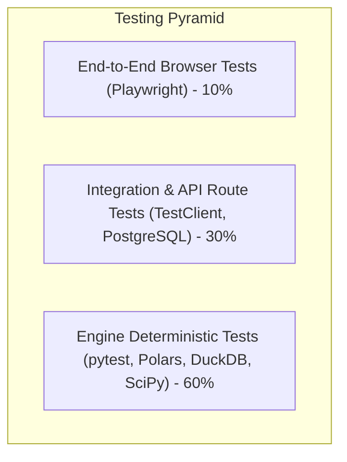

# AnalyzaX — Comprehensive Testing & Benchmark Strategy

This document establishes the testing principles, harness structure, test dataset specifications, and benchmarking methodology for **AnalyzaX**.

---

## 1. Testing Hierarchy & Philosophy

In accordance with the Development Constitution (AGENTS.md):
- **Rule 11:** Every major feature requires automated tests.
- **Rule 12:** Test before declaring a feature complete.
- **Rule 15 & 16:** Never create fake functionality or mock analytical calculations.



---

## 2. Engine-by-Engine Test Matrix

Every engine under `backend/app/engines/` must be paired with dedicated test suites:

| Engine | Primary Test Targets | Validation Criteria |
| :--- | :--- | :--- |
| **`ingestion`** | CSV (comma, tab, semicolon), Parquet, JSON, Excel; encoding detection (UTF-8, Latin-1); malformed headers. | Produces valid Parquet without data corruption or row loss. |
| **`profiling`** | Type inference (integer vs float vs string vs datetime); null counts; min/max/quantiles; memory footprint. | Profiling metrics match exact Polars ground truth on reference datasets. |
| **`quality`** | Completeness, duplicate detection, primary key integrity, type consistency, domain ranges, categories casing, format checks, outlier risk. | Identifies 100% of anomalies deterministically; penalty scoring produces expected score 0-100. |
| **`cleaning`** | Deduplication; missing value imputation (mean, median, mode); type casting; string trimming; outlier capping. | Child Parquet generated; parent intact; transformation diff matches expectation. |
| **`eda`** | Skewness, kurtosis, frequency counts, Pearson/Spearman correlation matrices. | Exact numerical equality with SciPy and NumPy reference implementations. |
| **`statistics`** | Two-sample t-test, Mann-Whitney U, ANOVA, Chi-Square, Shapiro-Wilk. | p-values and test statistics match SciPy outputs within `1e-6` precision tolerance. |
| **`sql`** | SQL AST validation; rejection of `DROP`, `DELETE`, `ALTER`, `COPY`, `INSTALL`; valid DuckDB execution; row limits; timeouts. | Hostile queries rejected with 100% precision; read queries return correct Arrow/JSON records. |
| **`ml`** | Task detection; feature preprocessing; train/test split; baseline model fitting; metrics generation. | Models fit deterministically using fixed random seeds; evaluation metrics calculated accurately. |
| **`forecasting`** | Frequency detection; missing timestamp handling; stationarity testing; ARIMA/ETS forecasts; confidence intervals. | Non-trivial confidence bands produced; horizon lengths respected. |
| **`visualization`** | Pydantic schema validation for ECharts specs; axis mapping; formatters. | Valid JSON produced matching Apache ECharts option schema. |
| **`export`** | CSV, Excel, Parquet, JSON, and PDF generation. | Generated files are structurally valid, non-empty, and open cleanly in standard external readers. |
| **`ai`** | Tool calling schema validation; prompt assembly; context packet boundaries (<8KB). | Rejects invalid tool arguments; graceful handling of provider timeouts. |

---

## 3. Test Dataset Portfolio

A standardized collection of reference datasets must be maintained under `tests/fixtures/` and generated via `scripts/generate_test_data.py`:

```
tests/fixtures/
├── sales.csv               # Clean transactional records (revenue, quantity, dates)
├── customers.csv           # Demographic & categorical attributes (age, country, tier)
├── marketing.csv           # Multi-channel campaign spend, clicks, conversions
├── ecommerce.csv           # Orders, line items, shipping fees, product categories
├── stocks.csv              # High-frequency financial time series (OHLCV)
├── time_series.csv         # Regular monthly & daily seasonal metrics for forecasting
└── messy_data.csv          # Intentionally corrupt, dirty dataset for stress testing
```

### The `messy_data.csv` Specification

`messy_data.csv` is the core benchmark dataset for the Data Quality and Cleaning engines. It intentionally includes:

1. **Missing Values:**
   - MCAR (Missing Completely at Random) nulls in numerical columns (e.g., `salary`).
   - Placeholder strings representing nulls: `"N/A"`, `"null"`, `"?"`, `"-"`, `""`.
2. **Duplicate Records:**
   - Exact duplicate rows (identical across all 15 columns).
   - Partial/near duplicates (same customer ID and email, slightly different timestamp).
3. **Inconsistent Categories:**
   - Casing variations: `"USA"`, `"usa"`, `"U.S.A."`, `"United States"`.
   - Trailing whitespaces: `"Active "`, `" Active"`, `"Active"`.
4. **Invalid Dates:**
   - Mixed date formats: `"2025-01-15"`, `"15/01/2025"`, `"Jan 15, 2025"`.
   - Impossible dates: `"2025-02-30"`, `"1900-00-00"`.
5. **Outliers & Extreme Values:**
   - Typographical anomalies: `age: 280`, `discount_rate: 9999%`.
   - Extreme negative numbers in strictly positive domains: `price: -45.00`.
6. **Incorrect Data Types:**
   - Numerical fields containing currency symbols and commas: `"$1,250.50"`.
   - Numeric fields polluted with text: `"100 (est)"`.
7. **Degenerate Columns:**
   - Constant column: all rows contain identical value `"CONSTANT_VAL"`.
   - Near-constant column: 99.9% identical values with 1 outlier.

---

## 4. Benchmark & Performance Strategy

To ensure AnalyzaX handles real-world scale:

### Synthetic Scale Benchmarks
- **Volume Tiers:**
  - Tier 1: 10,000 rows (~2 MB) — Target profiling time: `< 100 ms`
  - Tier 2: 100,000 rows (~20 MB) — Target profiling time: `< 500 ms`
  - Tier 3: 1,000,000 rows (~200 MB) — Target profiling time: `< 2.5 s`
  - Tier 4: 10,000,000 rows (~2 GB) — Out-of-core DuckDB SQL query: `< 1.5 s`

### Memory Ceiling Rules
- Worker memory consumption must not exceed `4 GB` during any single-engine execution.
- Operations on large tables must use Polars streaming (`LazyFrame.sink_parquet`) or DuckDB out-of-core execution rather than full in-memory materialization.

---

## 5. Frontend & Visual Verification Strategy

- **Component Unit Tests:** Vitest + React Testing Library for button states, modal interactions, and form validation.
- **Chart Verification:** Visual regression tests verifying that ECharts instances render with correct dimensions, valid series arrays, and zero DOM errors.
- **End-to-End Workflows (Playwright):**
  - Full happy path: Upload `sales.csv` ➔ View profile ➔ Approve clean ➔ Run SQL query ➔ View chart ➔ Export report.

